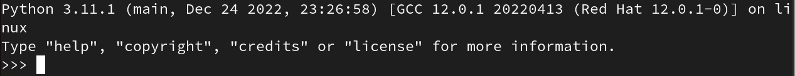
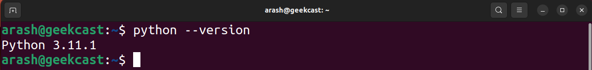

# فصل 2. نصب پایتون

پایتون بروی سیستم عامل های مک و لینوکس ( اکثر توزیع ها) به صورت پیش فرض نصب می باشد. برای نصب آخرین نسخه پایتون می توانید به آموزش مربوطه در این صفحه مراجعه کنید.

## نصب در ویندوز

<ol dir="rtl">
	<li>
		
از آدرس <a href="https://www.python.org/downloads">https://www.python.org/downloads</a> آخرین نسخه پایتون دانلود می کنیم.

	</li>
	<li>
		

		بعد از اجرا فایل دانلود شده، در پنجره نصب، قسمت پایین، تیک گزینه Add python.exe to PATH فعال می کنیم. با فعال بودن این گزینه امکان اجرا دستورات پایتون در محیط ترمینال میسر می شود.
		

	</li>
	<li>
		
برای اطمینان از صحت فرایند نصب، ابتدا پنجره ترمینال ( PowerShell یا Command Prompt ) باز می کنیم :

		<ul dir="rtl">
			<li>
				
روش اول : در جستجوی ویندوز عبارت Terminal جستجو می کنیم

			</li>
			<li>
				
روش دوم : با کلیدهای ترکیبی <kbd>Windows Key</kbd> + <kbd>R</kbd> پنجره Run باز می شود سپس عبارت cmd تایپ، سپس اجرا می کنیم

			</li>
		</ul>
	</li>
	<li>
		
با اجرای دستور ذیل در محیط ترمینال نسخه پایتون نصب شده نمایش داده می شود.

        

            <pre><code>python --version</code></pre>
        

	</li>
	<li>
		
با اجرای دستور ذیل در محیط ترمینال نسخه pip نصب شده نمایش داده می شود. ابزار pip به همراه پایتون نصب می شود و وظیفه مدیریت کتابخانه ها دارد.

        

            <pre><code>pip --version</code></pre>
        

	</li>
</ol>

در صورتیکه مراحل 4 و 5 در پنجره ترمینال، نسخه نرم افزار نمایش داده نشد، فرایند نصب تکرار کنید.

## نصب در اوبونتو / دبیان

<ol dir="rtl">
<li>
	

	در محیط Application به دنبال عبارت Terminal می گردیم.
	

	<ul dir="rtl">
		<li>
			

				روش اول : با کلیدهای ترکیبی <kbd>Ctrl</kbd> + <kbd>Shift</kbd> + <kbd>T</kbd> پنجره ترمینال باز می شود.
			

		</li>
		<li>
			

			روش دوم : در محیط Application به دنبال عبارت Terminal می گردیم.
			

		</li>
	</ul>
</li>
<li>
	

		با دستور ذیل لیست آخرین پکیج های موجود در مخزن دریافت می کنیم.
	

	<blockquote>
	دستور sudo برای اجرای دستورات با سطح دسترسی مدیر سیستم می باشد. ( مثل Run as administrator در ویندوز )
	</blockquote>
	

		<pre><code>sudo apt-get update</code></pre>
	

</li>
<li>
	

		این دستور پکیج های نصب شده از قبل، به آخرین نسخه موجود بروزرسانی می کند.
	

	

		<pre><code>sudo apt-get upgrade</code></pre>
	

</li>
<li>
	

		برای نصب آخرین نسخه پایتون باید از source code پایتون، build بگیریم. این فرایند نیاز به نصب پکیج های ذیل دارد.
	

	

		<pre><code>sudo apt-get install -y make build-essential libssl-dev zlib1g-dev libbz2-dev libreadline-dev libsqlite3-dev wget curl llvm libncurses5-dev libncursesw5-dev xz-utils tk-dev liblzma-dev tk-dev</code></pre>
	

</li>
<li>
	

		دایرکتوری ترمینال، به محلی که قصد دانلود source code داریم جا به جا می کنیم.
	

	<blockquote>
		دایرکتوری tmp محل نگهداری فایل های موقتی می باشد، به عبارت دیگر محتوای این دایرکتوری بعد از هر بار reset حذف می شود.
	</blockquote>
	

		<pre><code>cd /tmp/</code></pre>
	

</li>
<li>
	

		ابزار wget وظیفه دانلود فایل را دارد. به کمک این ابزار فایل فشرده source code پایتون دانلود می کنیم. ( آدرس دانلود نسخه های مختلف source code در سایت پایتون موجود می باشد )
	

	

		<pre><code>wget https://www.python.org/ftp/python/3.11.1/Python-3.11.1.tgz</code></pre>
	

</li>
<li>
	

		به محتوای این فایل فشرده باید دسترسی داشته باشیم برای اینکار با ابزار tar محتوای این فایل خارج می کنیم.
	

	

		<pre><code>tar xzf Python-3.11.1.tgz</code></pre>
	

	<blockquote>
		

			به هریک از حروف xzf که وظیفه اعمال تنظیماتی روی ابزار دارند flag گفته میشه. هرکدام از این کاراکترها اطلاعات مشخصی به ابزار tar می دهد :
		

		<ul dir="rtl">
			<li>
				<strong>x :</strong> عمل استخراج ( Extract ) انجام بشه.
			</li>
			<li>
				<strong>z :</strong> این فایل با الگوریتم gzip فشرده شده. ( از پسوند tgz می فهمیم ).
			</li>
			<li>
				<strong>f :</strong> هدف یک فایل می باشد.
			</li>
		</ul>
	</blockquote>
</li>
<li>
	

		محتوا درون دایرکتوری جدیدی **به نام همان فایل** ریخته شده. دایرکتوری از مکان فعلی به درون دایرکتوری جدید ساخته شده منتقل می کنیم.
	

	<blockquote>
		

			دقت شود که محیط ترمینال به سایز حروف حساس می باشد. در اینجا دایرکتوری با P بزرگ شروع شده.
on-3.11.1 با python-3.11.1 فرق داره !!! خیلی دقت بشه.
		

	</blockquote>
	

		<pre><code>cd Python-3.11.1</code></pre>
	

</li>
<li>
	

		نوبت به build گرفتن source code و نصب پایتون می باشد.
	

	

		<pre><code>sudo ./configure --enable-optimizations</code></pre>
	

	

		<pre><code>sudo make altinstall</code></pre>
	

</li>
<li>
	

		برای اطمینان از صحت فرایند نصب، دستور ذیل وارد می کنیم.
	

	

		<pre><code>python3.11</code></pre>
	

</li>
</ol>

## نصب در فدورا / سنت او اس

<ol dir="rtl">
<li>
	

		در محیط Application به دنبال عبارت Terminal می گردیم.
	

</li>
<li>
	

		با دستور ذیل لیست آخرین پکیج های موجود در مخزن نصب می کنیم.
	

	<blockquote>
	دستور sudo برای اجرای دستورات با سطح دسترسی مدیر سیستم می باشد. ( مثل Run as administrator در ویندوز )
	</blockquote>
	

		<pre><code>sudo dnf update -y</code></pre>
	

</li>
<li>
	

		برای نصب آخرین نسخه پایتون باید از source code پایتون، build بگیریم. این فرایند نیاز به نصب پکیج های ذیل دارد.
	

	

		<pre><code>sudo dnf install -y openssl-devel bzip2-devel expat-devel gdbm-devel readline-devel sqlite-devel</code></pre>
	

</li>
<li>
	

	دایرکتوری ترمینال، به محلی که قصد دانلود source code داریم جا به جا می کنیم.
	

	<blockquote>
	دایرکتوری tmp محل نگهداری فایل های موقتی می باشد، به عبارت دیگر محتوای این دایرکتوری بعد از هر بار reset حذف می شود.
	</blockquote>
	

		<pre><code>cd /tmp/</code></pre>
	

</li>
<li>
	

	ابزار wget وظیفه دانلود فایل را دارد. به کمک این ابزار فایل فشرده source code پایتون دانلود می کنیم. ( آدرس دانلود نسخه های مختلف source code در سایت پایتون موجود می باشد )
	

	

		<pre><code>wget https://www.python.org/ftp/python/3.11.1/Python-3.11.1.tgz</code></pre>
	

</li>
<li>
	

	به محتوای این فایل فشرده باید دسترسی داشته باشیم برای اینکار با ابزار tar محتوای این فایل خارج می کنیم.
	

	

		<pre><code>tar xzf Python-3.11.1.tgz</code></pre>
	

	<blockquote>
		

			به هریک از حروف xzf که وظیفه اعمال تنظیماتی روی ابزار دارند flag گفته میشه. هرکدام از این کاراکترها اطلاعات مشخصی به ابزار tar می دهد :
		

		<ul dir="rtl">
			<li>
				<strong>x :</strong> عمل استخراج ( Extract ) انجام بشه.
			</li>
			<li>
				<strong>z :</strong> این فایل با الگوریتم gzip فشرده شده. ( از پسوند tgz می فهمیم ).
			</li>
			<li>
				<strong>f :</strong> هدف یک فایل می باشد.
			</li>
		</ul>
	</blockquote>
</li>
<li>
	

		محتوا درون دایرکتوری جدیدی **به نام همان فایل** ریخته شده. دایرکتوری از مکان فعلی به درون دایرکتوری جدید ساخته شده منتقل می کنیم.
	

	<blockquote>
		

			دقت شود که محیط ترمینال به سایز حروف حساس می باشد. در اینجا دایرکتوری با P بزرگ شروع شده.
on-3.11.1 با python-3.11.1 فرق داره !!! خیلی دقت بشه.
		

	</blockquote>
	

		<pre><code>cd Python-3.11.1</code></pre>
	

</li>
<li>
	

		نوبت به build گرفتن source code و نصب پایتون می باشد.
	

	

		<pre><code>sudo ./configure --enable-optimizations</code></pre>
	

	

		<pre><code>sudo make altinstall</code></pre>
	

</li>
<li>
	

		برای اطمینان از صحت فرایند نصب، دستور ذیل وارد می کنیم.
	

	

		<pre><code>python3.11</code></pre>
	

</li>
</ol>

## تغییر نسخه پیش فرض پایتون در لینوکس

برای دسترسی به پایتون باید عبارت "python3.11" در ترمینال وارد کنیم. این خیلی سخته :tired_face: به جای این کار می توانیم از نام مستعار برای این دستور استفاده کنیم.

<ol dir="rtl">
<li>
	

		لینک مربوط به دستور python حذف می کنیم. ( ممکن است این فایل موجود نباشد. در صورت خطا از عدم موجودیت فایل، مرحله بعد انجام شود )
	

	

		<pre><code>sudo rm /usr/bin/python</code></pre>
	

</li>
<li>
	

		لینک جدیدی به نام "python" که اشاره می کند به نسخه ای از پایتون که نصب کردیم.
	

	

		<pre><code>sudo ln -s /usr/local/bin/python3.11 python</code></pre>
	

</li>
<li>
	

		نسخه نمایش داده شده باید با نسخه ای که نصب کردیم برابر باشد.
	

	

		<pre><code>python --version</code></pre>
	

</li>
</ol>

------

👋 Hi, I’m Arash Yeganeh.

How can you best ❤️ **Support me** ❤️  :

- Give me  [GitHub Stars ⭐](https://github.com/arashyeganeh) 
- Share my content to someone else 👀
- Follow me on [linkedin](https://www.linkedin.com/in/arash-yeganeh)
- Subscribe my [YouTube](https://www.youtube.com/channel/UCUuojnAmPiklBpAeBmHE4Aw) channel

