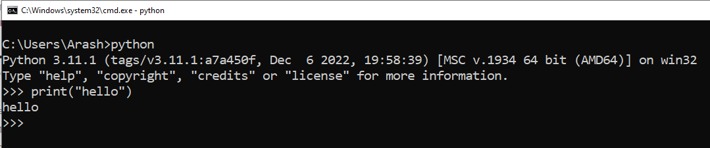
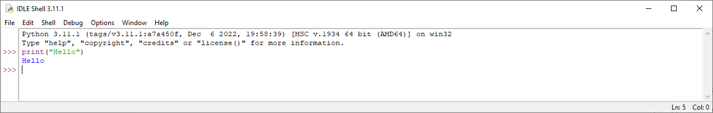
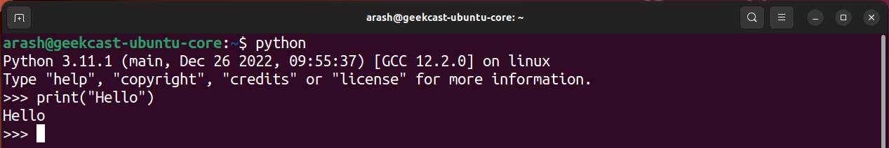
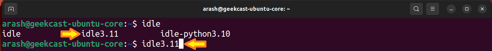
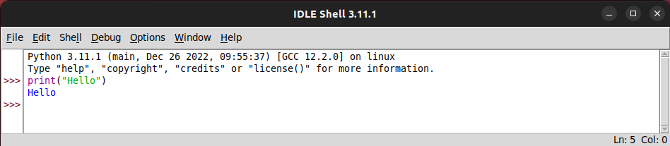
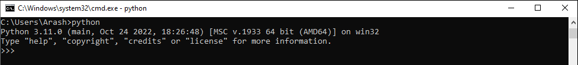
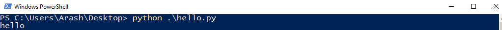

# فصل 3. سلام دنیای ...

اجرای دستورات، به 2 روش امکان پذیر می باشد :

<ul dir="rtl">
	<li>
	Interactive Mode
	</li>
	<li>
	Script Mode
	</li>
</ul>

## تعاملی ( Interactive Mode )

در این روش، دستورات خط به خط مستقیم درون مفسر ( interpreter ) تایپ می کنیم. این قابلیت به کمک ابزاری به نام Integrated Development and  Learning Environment یا به اختصار **IDLE** امکان پذیر می شود. برای دسترسی به محیط IDLE در سیستم عامل های مختلف مراحل ذیل انجام می دهیم :

> این روش، باتوجه به دشواری و محدودیت هایی که دارد به جزء موارد خاصی، توصیه نمی شود. ( بیشتر برای اجرای دستورات بدون نصب IDE در محیط هایی که از نظر امنیتی دارای حساسیت می باشند مثل سرورها، کاربرد دارد. )

### ویندوز

#### محیط ترمینال - بدون رابط گرافیکی

<ol dir="rtl">
<li>
	

	پنجره ترمینال باز می کنیم :
	

	<ul dir="rtl">
		<li>
			

				روش اول : در جستجوی ویندوز عبارت Terminal جستجو می کنیم.
			

		</li>
		<li>
			

				روش دوم : با کلیدهای ترکیبی <kbd>Windows Key</kbd> + <kbd>R</kbd> پنجره Run باز می شود سپس عبارت cmd تایپ، سپس اجرا می کنیم.
			

		</li>
	</ul>
</li>
<li>
	

		عبارت "python" در محیط ترمینال اجرا می کنیم.
	

	

		<pre><code>python</code></pre>
	

	

		<<< این علامت محل ورود دستورات نمایش می دهد.این دستورات بصورت مستقیم درون مفسر اجرا می شود. برای مثال می خواهیم عبارت "Hello" در خروجی نمایش دهیم :
	

	

		<pre><code>print("Hello")</code></pre>
	

</li>
</ol> 

#### برنامه IDLE Shell - محیط گرافیکی

این برنامه در زمان نصب پایتون به صورت خودکار نصب می شود. فقط کافیست عبارت IDLE در جستجوی ویندوز وارد کنید.

به کمک برنامه IDLE در محیط گرافیکی امکاناتی از جمله دیباگ کردن، اضافه کردن فایل های خارجی، ذخیره کردن دستورات و ... نسبت به محیط ترمینال دارید.

### لینوکس

#### محیط ترمینال - بدون رابط گرافیکی

<ol dir="rtl">
<li>
	

	پنجره ترمینال باز می کنیم.
	

</li>
<li>
	

	عبارت "python" در محیط ترمینال اجرا می کنیم.
	

	

		<pre><code>python</code></pre>
	

	

	<<< این علامت محل ورود دستورات نمایش می دهد.این دستورات بصورت مستقیم درون مفسر اجرا می شود. برای مثال می خواهیم عبارت "Hello" در خروجی نمایش دهیم :
	

	

		<pre><code>print("Hello")</code></pre>
	

</li>
</ol>

#### برنامه IDLE Shell - محیط گرافیکی

<ol dir="rtl">
	<li>
		

		پنجره ترمینال باز می کنیم.
		

	</li>
	<li>
		

		برنامه "idle" نصب می کنیم.
		

		<ul dir="rtl">
			<li>
				

					در صورتیکه سیستم عامل اوبونتو / دبیان باشد :
				

				

					<pre><code>sudo apt-get install idle</code></pre>
				

			</li>
			<li>
				

					در صورتیکه سیستم عامل فدورا / سنت او اس باشد :
				

				

					<pre><code>sudo dnf install idle</code></pre>
				

			</li>
		</ul>
	</li>
	<li>
		

            با توجه به نسخه ای که نصب می کنید، شماره نسخه ای که باید در انتهای "idle" بنویسیم متفاوت می باشد.عبارت "idle" تایپ می کنیم، سپس 2 بار کلید tab فشار می دهیم. با اینکار دستورات پیشنهادی که با عبارت "idle" شروع می شوند نمایش می دهد سپس عدد نسخه موردنظر وارد می کنیم.
        

		

			<pre><code>idle3.11</code></pre>
		

	</li>
</ol>

### خروج از محیط IDLE بدون بستن پنجره ترمینال

برای خروج از محیط IDLE بدون بستن پنجره ترمینال، 3 روش ذیل قابل اجرا می باشد. دستورات ذیل مقابل <<< وارد کنید : 

<ul dir="rtl">
	<li>
		

		روش اول : تابع quit صدا بزنیم.
		

		

			<pre><code>quit()</code></pre>
		

	</li>
	<li>
		

		روش دوم : تابع exit صدا بزنیم.
		

		

			<pre><code>exit()</code></pre>
		

	</li>
	<li>
		

		روش سوم : کلید ترکیبی <kbd>Ctrl</kbd>+<kbd>z</kbd> فشار میدیم، سپس enter وارد کنیم.
		

		

			<pre><code>^Z</code></pre>
		

	</li>
</ul>

## اسکریپت ( Script Mode )

این روش برخلاف روش تعاملی ( Interactive Mode )، دستورات درون یک فایل با پسوند py ذخیره می کنیم، سپس فایل در محیط ترمینال اجرا می کنیم.

### ویرایشگر فایل

می خواهیم عبارت "hello" در خروجی نمایش داده شود :

<ol dir="rtl">
	<li>
		

		برنامه ویرایشگر متن باز می کنیم
		

	</li>
	<li>
		

		دستور ذیل تایپ می کنیم.
		

		

			<pre><code>print("Hello")</code></pre>
		

	</li>
	<li>
		

		فایل به نام hello.py ذخیره می کنیم. ( پسوند py ذخیره بشه )
		

	</li>
	<li>
		

		وارد محیط ترمینال می شویم. آدرس جاری ترمینال به محل ذخیره شده فایل hello.py جا به جا می کنیم.
		

	</li>
	<li>
		

		با دستور ذیل فایل hello.py اجرا می کنیم.
		

		

			<pre><code>python hello.py</code></pre>
		

	</li>
</ol>

### استفاده از برنامه های IDE - ( بهترین روش )

بهترین روش برای برنامه نویسی استفاده از برنامه های  IDE ( Integrated development environment )می باشد. این دسته از برنامه ها قابلیت هایی بسیار فراتر از روش IDLE و برنامه های ویرایشگر متن به شما می دهند. از جمله قابلیت های IDE می توان به موارد ذیل اشاره کرد : 

* رعایت عمق ها و مرتب کردن دستورات و دادن استایل رنگی ( در خوانایی کد بسیار موثر هست )
* ابزار های دیباگ ( عیب یابی )
* اتصال به سایر برنامه ها ( مثل گیت )
* و ....

------

👋 Hi, I’m Arash Yeganeh.

How can you best ❤️ **Support me** ❤️  :

- Give me  [GitHub Stars ⭐](https://github.com/arashyeganeh) 
- Share my content to someone else 👀
- Follow me on [linkedin](https://www.linkedin.com/in/arash-yeganeh)
- Subscribe my [YouTube](https://www.youtube.com/channel/UCUuojnAmPiklBpAeBmHE4Aw) channel
