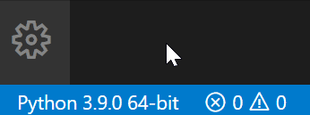
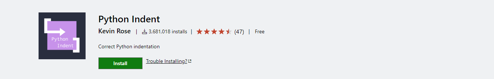
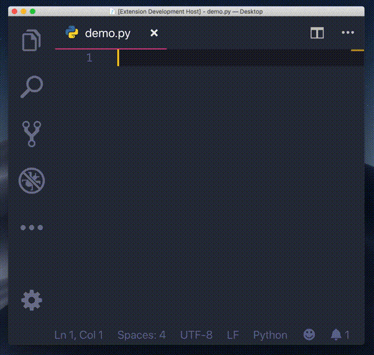
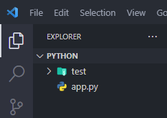
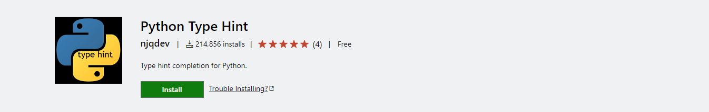
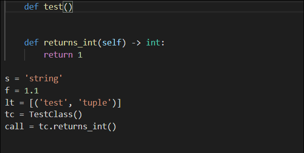
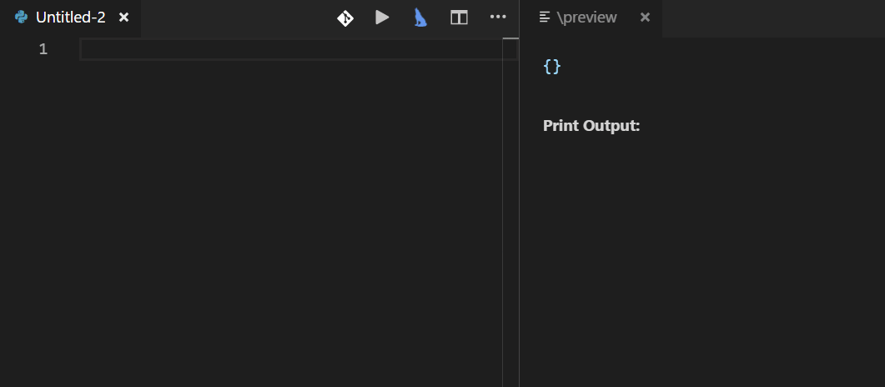

# فصل 4. Visual Studio Code

انتخاب IDE مناسب در روند تولید پروژه بسیار حائز اهمیت می باشد، از جمله پارامترهایی که در انتخاب IDE باید مدنظر داشته باشیم، وجود تنوع در افزونه ها، قالب های متنوع، پشتیبانی از زبان پارسی، رایگان بودن می باشد.

> با اتصال VS Code به حساب مایکروسافت یا گیت هاب امکان سینک شدن تنظیمات برنامه در سیستم های مختلف فراهم می شود.

[دانلود VS Code](https://code.visualstudio.com/Download)

## افزونه های کاربردی ( VS Code Extensions )

<h3 dir="rtl">
    Python
</h3>

افزونه رسمی مایکروسافت، برای اجرای پایتون در محیط VS Code می باشد.

[لینک دانلود](https://marketplace.visualstudio.com/items?itemName=ms-python.python)

  

<h3 dir="rtl">
     Python Indent
</h3>

به صورت خودکار فرورفتگی ( Indent )، در بلوک ها ( Suite ) اضافه می کند.

[لینک دانلود](https://marketplace.visualstudio.com/items?itemName=KevinRose.vsc-python-indent)

  

<h3 dir="rtl">
	Material Icon Theme
</h3>

ایکون های متریال دیزاین ( سبک ایکون های اندروید ) به فایل ها و فولدر ها، متناسب با هر زبان به پنجره explorer اضافه می کند.

[لینک دانلود](https://marketplace.visualstudio.com/items?itemName=PKief.material-icon-theme)

  

<h3 dir="rtl">
	 Better Comments
</h3>

این افزونه، به کامنت استایل می دهد.

[لینک دانلود](https://marketplace.visualstudio.com/items?itemName=aaron-bond.better-comments)

  

<h3 dir="rtl">
	 Python Type Hint
</h3>

نوع Data Type در آرگومان و مقدار بازگشتی توابع مشخص می کند.

[لینک دانلود](https://marketplace.visualstudio.com/items?itemName=njqdev.vscode-python-typehint)

  

<h3 dir="rtl">
	AREPL for python
</h3>

با اعمال تغییرات در کد به صورت خودکار ، در لحظه خروجی برنامه بروز می شود.

[لینک دانلود](https://marketplace.visualstudio.com/items?itemName=almenon.arepl)

  

<h3 dir="rtl">
	Python Snippets
</h3>

با پیشنهاد دستورات بعدی و توضیحاتی درباره دستورات، کمک بسیار زیادی در کدنویسی و کاهش خطا می کند.

[لینک دانلود](https://marketplace.visualstudio.com/items?itemName=frhtylcn.pythonsnippets)

  

------

👋 Hi, I’m Arash Yeganeh.

How can you best ❤️ **Support me** ❤️  :

- Give me  [GitHub Stars ⭐](https://github.com/arashyeganeh) 
- Share my content to someone else 👀
- Follow me on [linkedin](https://www.linkedin.com/in/arash-yeganeh)
- Subscribe my [YouTube](https://www.youtube.com/channel/UCUuojnAmPiklBpAeBmHE4Aw) channel
