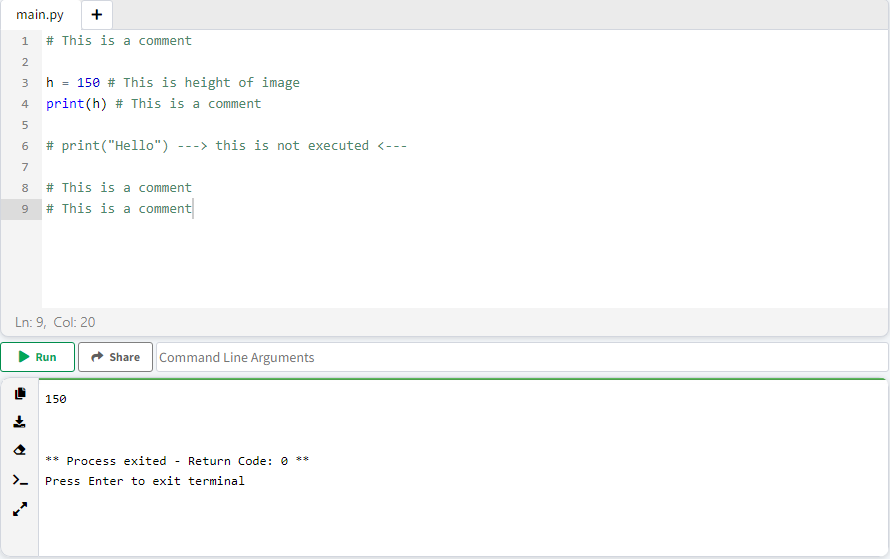
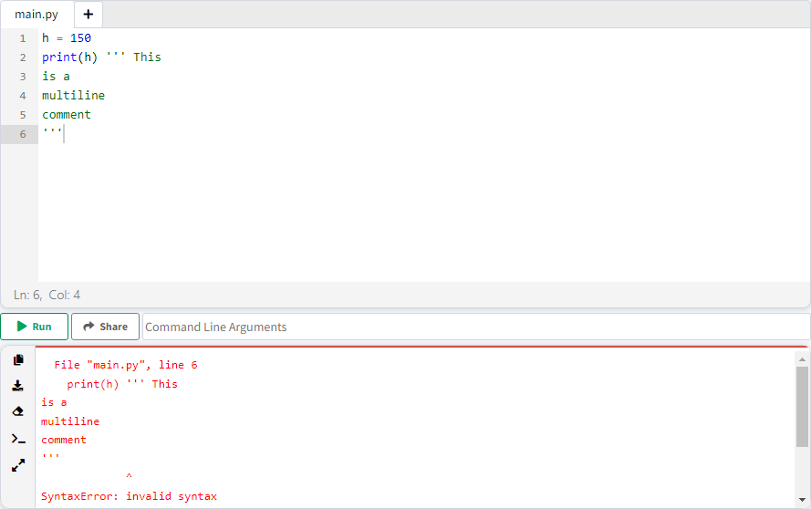

# فصل 5. توضیح ( Comment )

هدف از نوشتن comment، افزایش خوانایی کد و توضیحی برای عملکرد دستورات می باشد. در برنامه نویسی نوشتن comment بسیار رایج می باشد، مهم نیست شما انفرادی روی پروژه فعالیت می کنید یا عضوی از یک تیم هستید، با نوشتن comment در هر بخش از کد که نیاز به توضیح دارد، باعث افزایش سرعت برنامه نویسی و کاهش خطا می شود.

## چرا Comment میزاریم :

<ol dir="rtl">
<li>
	<p>
	افزایش خوانایی و درک عملکرد دستورات، بدون نیاز به بررسی سایر دستورات، برای درک عملکرد اون بخش از برنامه.
	</p>
	<div dir="ltr" align="left">
<pre><code># This is a comment
h = 150 # This is height of image
print(h)</code></pre>
	</div>
</li>
<li>
	<p>
	ممانعت از اجرای بخشی از دستورات، بدون نیاز به حذف اون بخش از برنامه.
	</p>
	<div dir="ltr" align="left">
<pre><code>print(1)
# print(2) ---> this is not executed <---
print(3)
</code></pre>
	</div>
</li>
</ol>


## انواع Comment :

### تک خطی ( Single Line )

به هر توضیح تک خطی یا دستور تک خطی ( می خواهیم مانع از اجرای آن بشویم )،کامنت تک خطی گفته می شود.

برای نوشتن کامنت تک خطی، کافیست در ابتدای توضیح یا دستور علامت "#" بنویسیم. می توانیم در مقابل یک دستور، کامنت بنویسیم. ( نیازی به نوشتن اول خط نیست )

**دستورات بعد از "#" اجرا نمی شوند.**

```python
# This is a comment

h = 150 # This is height of image
print(h) # This is a comment

# print("Hello") ---> this is not executed <---

# This is a comment
# This is a comment
```



**دقت کنید که خط شماره 6 به دلیل کامنت بودن اجرا نشد!**

### چند خطی ( Multi Line )

زمانیکه توضیحات و دستورات، **بیش از یک خط باشند** ، کامنت چند خطی گفته می شود.

در این روش ابتدا و انتهای متن با **3 بار <kbd>"</kbd> ( نقل قول جفتی )  یا 3 بار  <kbd>'</kbd> ( نقل قول تکی )** می نویسیم و **حتما حتما باید از ابتدای خط شروع شود**.

```python
""" This
is a
multiline
comment
"""

h = 150 # This is height of image
print(h)

''' This
is a
multiline
comment
'''
```

> 💡 در کامنت گذاری چند خطی، برخلاف کامنت گذاری تک خطی، نمی توانیم، کامنت را از مقابل دستور بنویسیم و حتما باید در ابتدای خط جدید نوشته شود.

```python
h = 150
print(h) ''' This
is a
multiline
comment
'''
```




------

👋 Hi, I’m Arash Yeganeh.

How can you best ❤️ **Support me** ❤️  :

- Give me  [GitHub Stars ⭐](https://github.com/arashyeganeh) 
- Share my content to someone else 👀
- Follow me on [linkedin](https://www.linkedin.com/in/arash-yeganeh)
- Subscribe my [YouTube](https://www.youtube.com/channel/UCUuojnAmPiklBpAeBmHE4Aw) channel
