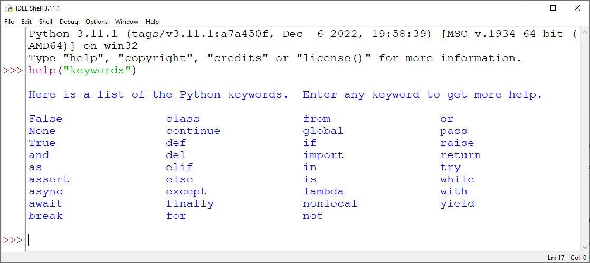
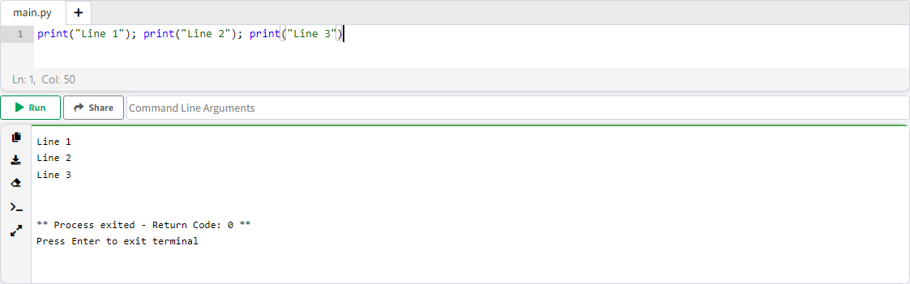
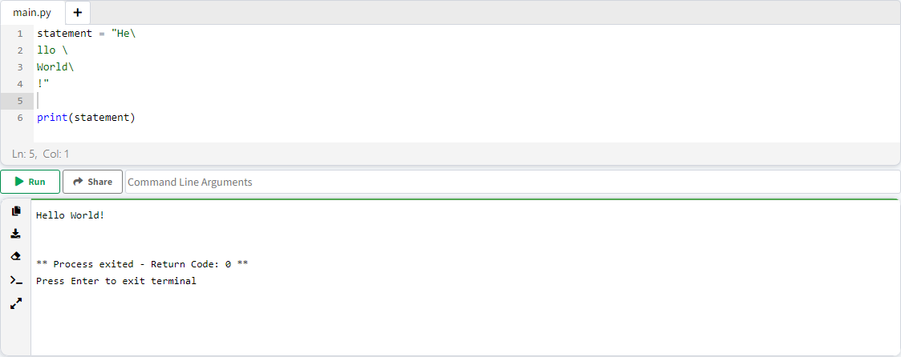
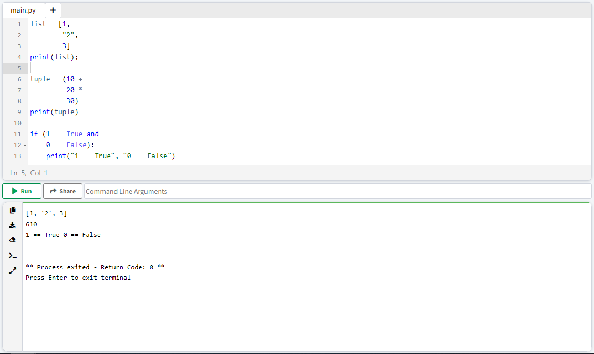
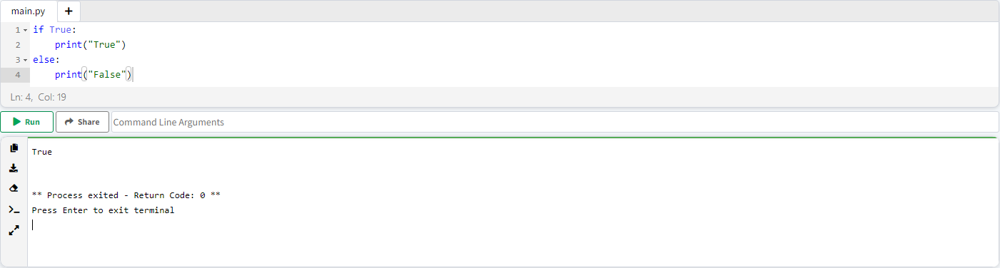
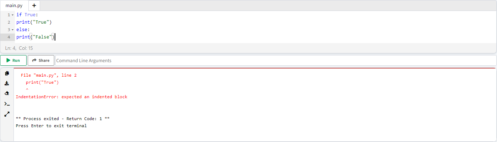

# فصل 6. Identifier

## قوانین انتخاب نام متغییرها ( Rules For Naming Variables )

برای انتخاب نام در پایتون، باید این قوانین رعایت شود :

### قانون 1. نام باید فقط شامل ...

نام باید فقط شامل ( در تمام قسمت های نام; اول / وسط / آخر ) :

* کاراکترهای A-Z ( بزرگ یا کوچک )
* اعداد 0-9
* underscore "_"

باشد.

**نکته** : سیمبل شامل این قوانین نمی شود : ❌

<ul dir="rtl">
	<li>
		! ,@ , # , $ ,% ,- , ^ , ...
	</li>
</ul>

### قانون 2. اولین حرف نام باید ...

اولین کاراکتری که برای نام انتخاب می کنیم باید یکی از این 2 شرط مورد قبول باشد :

<ul dir="rtl">
	<li>
		A-Z یا a - z 
	</li>
	<li>
		underscore "_"
	</li>
</ul>

**نکته** : اعداد شامل نمی شوند.

### قانون 3. استفاده از اسامی رزرو شده ...

نام نباید یکی از اسامی رزرو شده پایتون باشد. ❌


<p align="center">لیست اسامی رزرو شده در پایتون</p>

```tex
Python Keywords 3.11.1
Here is a list of the Python keywords.

False               class               from                or
None                continue            global              pass
True                def                 if                  raise
and                 del                 import              return
as                  elif                in                  try
assert              else                is                  while
async               except              lambda              with
await               finally             nonlocal            yield
break               for                 not
```


> 💡 لیست اسامی رزرو شده در هر اپدیت پایتون، دچار تغییراتی می شود.

برای مشاهده لیست کلمات رزرو شده متناسب نسخه پایتون، کافیست در محیط IDLE تابع help("keywords") صدا بزنیم.

```python
help("keywords")
```



### قانون 4. حساس به اندازه حروف ( Case Sensetive )

پایتون به اندازه حروف حساس می باشد (Case Sensetive)، به عبارت دیگر نام های ذیل باهم متفاوت می باشند :

<ul dir="rtl">
	<li>
		Var
	</li>
	<li>
		var
	</li>
	<li>
		vaR
	</li>
	<li>
		VaR
	</li>
</ul>


با توجه به این 5 قانون، به نام های ذیل دقت کنید :

|  مثال  | درست یا غلط ؟ | شماره قانون نقض شده ؟ |
| :----: | :-----------: | :-------------------: |
| abc123 |       ✅       |           -           |
| 123abc |       ❌       |           2           |
| abc_eg |       ✅       |           -           |
| abc-eg |       ❌       |           1           |
|  abc@  |       ❌       |           1           |
|  _abc  |       ✅       |           -           |
|  ABC   |       ✅       |           -           |
| False  |       ❌       |           3           |
| false  |       ✅       |           -           |

## الگوی نامگذاری اسامی چند بخشی ( Naming Styles )

بین برنامه نویسان، الگوهایی برای نامگذاری اسامی چند بخشی تعریف شده، چند مورد از پر استفاده ترین الگوها در ذیل بررسی می کنیم :

### الگوی snake_case

1. تمام حروف به صورت کوچک نوشته می شود.
2. فاصله بین کلمات با "_" جایگزین می شود.

|    کلمه     |   شرط اول   |   شرط دوم   |
| :---------: | :---------: | :---------: |
| Hello World | hello world | hello_world |
|  Geek Cast  |  geek cast  |  geek_cast  |
| Snake Case  | snake case  | snake_case  |

### الگوی PascalCase

1. تمام حروف به صورت بزرگ نوشته می شود.
2. فاصله بین کلمات حذف می شود.

|    کلمه     |   شرط اول   |  شرط دوم   |
| :---------: | :---------: | :--------: |
| Hello World | Hello World | HelloWorld |
|  Geek cast  |  Geek Cast  |  GeekCast  |
| pascal case | Pascal Case | PascalCase |

### الگوی camelCase

1. فقط حرف اول کلمات **به جزء کلمه اول** به صورت بزرگ نوشته می شود.
2. فاصله بین کلمات حذف می شود.

|    کلمه     |   شرط اول   |  شرط دوم   |
| :---------: | :---------: | :--------: |
| Hello World | hello World | helloWorld |
|  Geek cast  |  geek Cast  |  geekCast  |
| camel case  | camel Case  | camelCase  |

> 💡 الگوهای بسیاری تعریف شده از جمله Macro_Case, kebab-case, Train-Case, UPPER CASE و حتی الگوهای ترکیبی مثل UPPER_CASE_SNAKE_CASE ولی به دلیل کمتر کاربردی بودن، توضیح داده نشد.

## قوانین کد نویسی ( Rules for coding )

* دستورات در یک خط می نویسیم.
* انتهای خطوط ";" (Semicolon) نمی نویسیم. ( این امر اختیاری می باشد ولی طبق مفهوم پایتون نباید بنویسیم )

```python
print("Line 1")
print("Line 2")
print("Line 3")
```

* نقطه ویرگول ";" فقط در زمانی **اجباری** می باشد که بخواهیم چند خط دستور، در یک خط بنویسیم.

```python
print("Line 1"); print("Line 2"); print("Line 3")
```


#### شکوندن دستورات در چند خط ( Wrap Long Line )

زمانیکه توالی مولفه های دستور طولانی باشد، برای خوانایی بیشتر می توانیم، یک خط دستور به چند خط تقسیم کنیم.

* اگر دیتا بین کوتیشن " " نوشته شده بود، هر جا که خواستیم بریم خط بعدی ، "\\" (backslash)  می نویسیم.

> * "\\" backslash ( بالای کلید Enter می باشد )
> * "/" slash

```python
statement = "He\
llo \
World\
!"

print(statement)
```



شکوندن در چند خط تاثیری در دیتا ندارد. خروجی در یک خط نمایش داده شده.

* اگر دیتا، درون یکی از ( ) پرانتز، [ ] براکت، { } بریس نوشته شده بود، بعد از ویرگول ","، عملگرهای منطقی و عملگرهای ریاضی به خط بعدی می رویم.

```python
list = [1,
        "2",
        3]
print(list);

tuple = (10 +
         20 *
         30)
print(tuple)

if (1 == True and
    0 == False):
    print("1 == True", "0 == False")
```



### بلوک کد ( Suite )

به مجموعه دستوراتی که در یک بلوک کد قرار می گیرد، suite گفته می شود. suite با علامت ":" شروع می شوند.

suite برای حلقه ها، شرط ها و توابع کاربرد دارد.

```python
if 2>1:
	statement1
	statement2
	statement3
else:
	statement1
	statement2
    
while True:
	statement1

def getColor():
    statement1
    statement2
```
#### فرورفتگی ( Indentation )

به فاصله شروع دستورات از اول خط فرورفتگی ( Indent ) گفته می شود.

با فشردن دکمه <kbd>Tab</kbd> ، فرورفتگی ( Indent ) ایجاد می شود.


```python
if True:
    print("True")
else:
    print("False")
```


به indent ها دقت بشه، مثال ذیل بدون رعایت فواصل هست که با خطا مواجه میشه :

```python
if True:
print("True")
else:
print("False")
```



### نقل قول ( Quotation )

نقل قول برای مقدار دهی متن ( String یا رشته ) به متغییر استفاده می شود. تفاوتی بین نقل قول تکی و جفتی وجود ندارد.

* double qutation ( " " )
* single qutation ( ' ' )

متن موردنظر، **تک خطی** باشد، از کوتیشن تکی یا جفتی استفاده می کنیم. ولی اگر متن موردنظر، **چند خطی** باشد، از **3 تا کوتیشن** تکی '''   ''' یا جفتی """   """ استفاده می کنیم.

|                        | تک خطی | چند خط |
| :--------------------: | :----: | :----: |
|      " " یا '  '       |   ✅    |   ❌    |
| """   """ یا '''   ''' |   ✅    |   ✅    |

```python
text = '(1) Hello world!'
print(text)

text2 = "(2) Hello world!"
print(text2)

text3 = '''(3) Hello world!'''
print(text3)

text4 = '''(4) This is a paragraph. It is
made up of multiple lines and sentences.'''
print(text4)

text5 = """(5) This is a paragraph. It is
made up of multiple lines and sentences."""
print(text5)
```


------

👋 Hi, I’m Arash Yeganeh.

How can you best ❤️ **Support me** ❤️  :

- Give me  [GitHub Stars ⭐](https://github.com/arashyeganeh) 
- Share my content to someone else 👀
- Follow me on [linkedin](https://www.linkedin.com/in/arash-yeganeh)
- Subscribe my [YouTube](https://www.youtube.com/channel/UCUuojnAmPiklBpAeBmHE4Aw) channel
