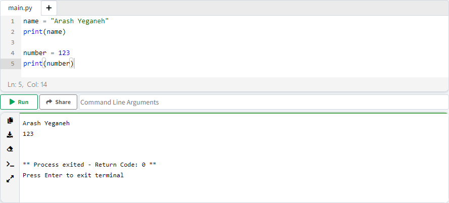
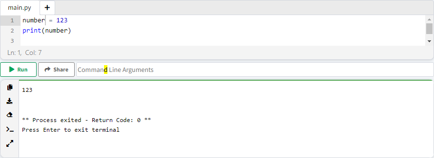
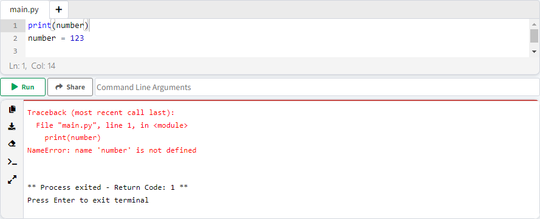
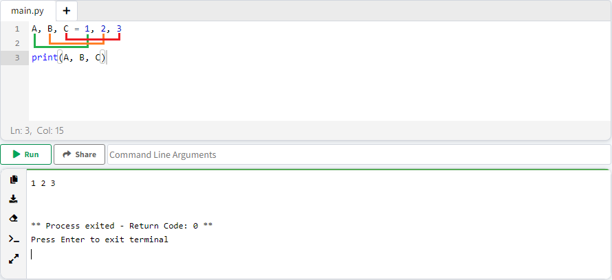

# فصل 7. متغییر ( Variable )

فضایی از حافظه موقت، که اطلاعات در اون بخش ذخیره می شود، متغییر گفته می شود.

ظرفی در نظر بگیرید، در این ظرف ماست میریزیم، خالیش می کنیم، دفعه بعد نمک میریزیم. در این مثال کاسه، حافظه موقت می باشد و ماست و نمک اون اطلاعاتی می باشد که درون حافظه موقت نگهداری می کنیم.

## قوانین تعریف متغییر ( Rules For Creating Variables )

### قانون 1. مقدار دهی متغییر ( Declare Variable )

برای مقدار دهی به متغییر از علامت "=" استفاده می کنیم

```python
name = "Arash Yeganeh"
print(name)

number = 123
print(number)
```

متغییر اول به نام "name" با مقدار "Arash Yeganeh" و متغییر دوم به نام "number" با مقدار "123" مقدار دهی شده.

تابع print مقدار ذخیره شده در متغییر، چاپ می کند.



### قانون2. اول متغییر تعریف کنید بعد استفاده کنید

قبل از استفاده از متغییر، باید متغییر تعریف شده باشد.

```python
number = 123
print(number)
```



مثال ذیل، اول متغییر صدا میزنیم، سپس تعریف می کنیم که با خطا مواجه می شویم.

```python
print(number)
number = 123
```



## خلاصه نویسی

### چند متغییر در یک خط

```python
A = 1
B = 2
C = 3

print(A, B, C)
```

برای تعریف چند متغییر در چند خط، می توانیم متغییر ها به **ترتیب** پشت سرهم قبل از علامت "=" بنویسیم، سپس مقادیر متناظر هر متغییر به **ترتیب** بعد از "=" تعریف می کنیم. مقادیر و متغییر ها با علامت "," از هم جدا می شوند.

```python
A, B, C = 1, 2, 3

print(A, B, C)
```



### متغییرهایی با مقدار برابر

```python
A = 1
B = 1
C = 1

print(A, B, C)
```

برای اعمال مقدار مشابه بین چند متغییر از الگوی ذیل استفاده می کنیم

```python
A = B = C = 1

print(A, B, C)
```


------

👋 Hi, I’m Arash Yeganeh.

How can you best ❤️ **Support me** ❤️  :

- Give me  [GitHub Stars ⭐](https://github.com/arashyeganeh) 
- Share my content to someone else 👀
- Follow me on [linkedin](https://www.linkedin.com/in/arash-yeganeh)
- Subscribe my [YouTube](https://www.youtube.com/channel/UCUuojnAmPiklBpAeBmHE4Aw) channel
