# فصل 7. انواع داده ( Data Types )

انواع داده در زبان پایتون به 6 دسته کلی تقسیم بندی می شود:

<ol dir="rtl">
<li>
	<p>
	عددی ( Numeric )
	</p>
	<ul dir="rtl">
		<li>
			<p>
				اعداد صحیح ( Integer / Int )
			</p>
		</li>
		<li>
			<p>
				اعشاری ( Floating-Point / Float )
			</p>
		</li>
		<li>
			<p>
				مختلط ( Complex )
			</p>
		</li>
	</ul>
</li>
<li>
	<p>
	توالی ( Sequence )
	</p>
	<ul dir="rtl">
		<li>
			<p>
				رشته ( String )
			</p>
		</li>
		<li>
			<p>
				لیست ( List )
			</p>
		</li>
		<li>
			<p>
				چندتایی ( Tuple )
			</p>
		</li>
	</ul>
</li>
<li>
	<p>
	ست ( Set )
	</p>
</li>
<li>
	<p>
	دیکشنری ( Dictionary  / Dict )
	</p>
</li>
<li>
	<p>
	بولی ( Boolean )
	</p>
</li>
<li>
	<p>
	هیچ ( None )
	</p>
</li>
</ol>


## 1. عددی ( Numeric )

### 1-1. اعداد صحیح ( Integer / Int )

اعداد int شامل خصوصیات ذیل می باشند:

* فاقد اعشار می باشند.
* می تواند مقداری مثبت، منفی و صفر داشته باشند.

```
✅ 0
✅ 5
✅ 10
✅ 9999999999999999999999999999999999999999999999999999999999999999999999999999999999999999999
✅ -9999999999999999999999999999999999999999999999999999999999999999999999999999999999999999999
✅ 10000000000000000000000000000000000000000000000
✅ -999
✅ 0x123
✅ -0x123
✅ 0x50
❌ 5.6
❌ 1.0
❌ 0.0
❌ -0.0
❌ 2 + 2j
❌ 3e2
❌ 1.3e-1
```

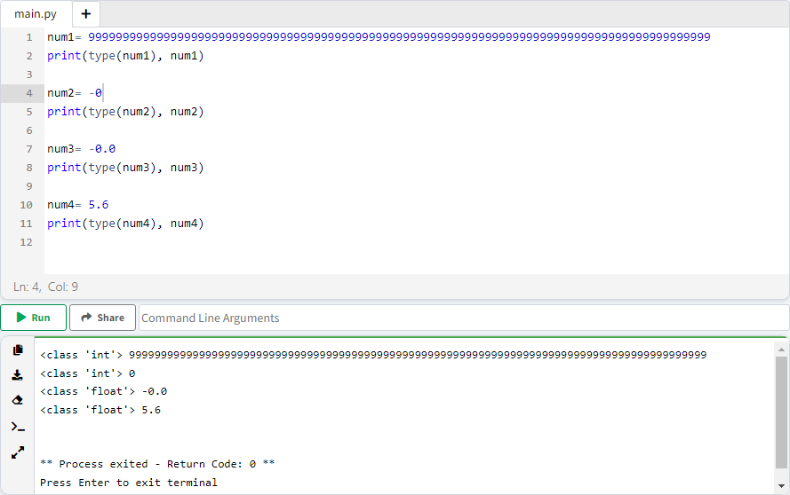

### 2-1. اعشاری ( Floating-Point / Float )

اعداد float، مانند اعداد int می باشند ولی **شامل بخش اعشاری** هستند.

```
✅ 0.0
✅ -0.0
✅ 0.1
✅ 1.0
✅ 1.9999999
✅ 1.00000000000000000000000000000000000000000009
✅ -60.5e100
✅ 35e2
✅ 1.3e-1
❌ 2 + 2j
❌ 0
```

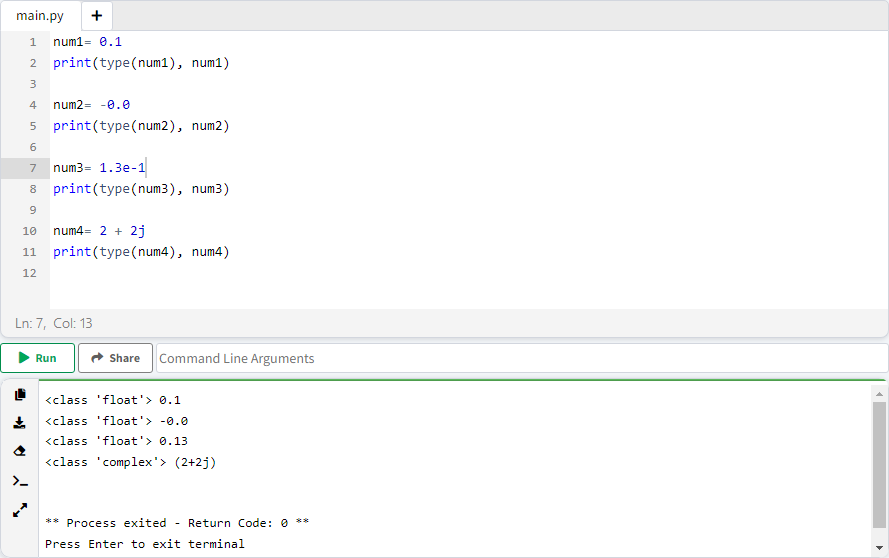

<h4 dir="rtl">
Exponential Notation
</h4>

 <p dir="rtl">
 exponential notation یا بطور خلاصه e notation روشی برای بیان ساده تر اعداد بزرگ در مبنای 10 می باشد. عدد بعد از کاراکتر e ( یا E )، مقدار توان در مبنای 10 مشخص می کند.
</p>

<div dir="ltr">
 5e3 = 5 * 10<sup>3</sup>
</div>
<div dir="ltr">
 -60.5e100 = -6.05 * 10<sup>101</sup>
</div>
<div dir="ltr">
 35e2 = 3.5 * 10<sup>3</sup>
</div>
<div dir="ltr">
 1.3e-1 = 1.3 * 10<sup>-1</sup>
</div>


### 3-1. مختلط ( Complex )

اعداد complex، از 2 بخش حقیقی و موهومی تشکیل می شوند :

<div align="center">
<span>a</span>
 + <span>b</span>j
</div>

<ul dir="rtl">
	<li>
		<p>
			a و b حقیقی
		</p>
	</li>
	<li>
		<p>
			j (J) موهومی
		</p>
	</li>
</ul>


برای ساخت عدد complex، **باید b مقدار داشته باشد ولی a اختیاری می باشد.**

```
✅ 3.14j
✅ 46.j
✅ 10.123e-45j
✅ .654j
✅ -.6545+0J
✅ 3e+26J
✅ 4.53e-7j
✅ 1+0j
❌ 0
❌ 1.5
```


مثال ذیل تاثیر وجود یا عدم وجود پارامترهای a, b بر عدد complex نمایش می دهد.

> 💡 دقت کنید، بدیهی می باشد که عدم تعریف پارامتر b، ضریب j همانند یک متغییر عمل می کند و عدد complex نخواهد بود.

```tex
❌ 1+j
✅ 1 + 0j
❌ j
✅ 0j
```

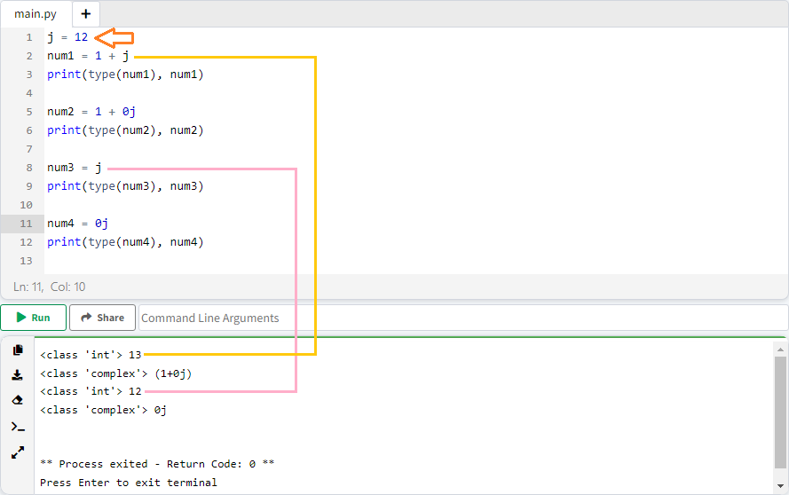

### روش ساده برای تشخیص نوع داده عددی

1. اگر کاراکتر j به همراه ضریب b بود => complex
2. اگر شرط 1 صادق نبود ولی اعشاری بود => float
3. شرط 1 و 2 نبود => int

## 2. توالی ( Sequence )

به مجموعه ای از دیتا که دارای ترتیب مشخصی می باشند، sequence گفته می شود.

### منظور از index  چیست؟

هر واحد از یک توالی دیتا، به ترتیب شماره گذاری می شود. این شماره گذاری شامل ویژگی های ذیل می باشد:

* از شماره **صفر** شروع می شود.
* شماره گذاری به ترتیب و افزایشی می باشد. 
* در هر مرحله یک واحد افزایش پیدا می کند. اولین عضو شماره صفر دارد، عنصر دوم دارای شماره 1 و الی آخر ...
* می تواند عددی منفی باشد، در این صورت اعداد منفی از انتهای توالی محاسبه می شوند. عدد **صفر اولین عضو** و عدد **منفی یک اخرین عضو** می باشد.

|                |  H   |  e   |  l   |  l   |  o   |
| :------------: | :--: | :--: | :--: | :--: | :--: |
|     index      |  0   |  1   |  2   |  3   |  4   |
| negative index |  -5  |  -4  |  -3  |  -2  |  -1  |

```python
str = "Hello"
print(str[0], str[1], str[2], str[3], str[4])
print(str[-1], str[-2], str[-3], str[-4], str[-5])
```

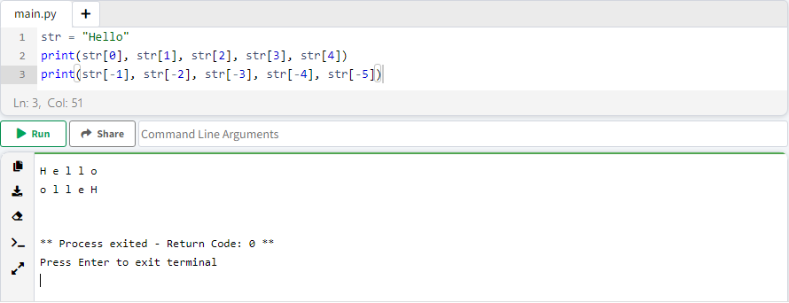

### 1-2. رشته ( String )

به توالی کاراکترها که در یک متغییر ذخیره می شوند، string گفته می شود ( در واقع string ها همان متن می باشد ). برای مقدار دهی string از کوتیشن ( تکی، جفتی، سه تایی ) استفاده می کنیم. 

```python
str1 = "Arash Yeganeh"
str2 = 'Arash Yeganeh'
str3 = """Arash 
Yeganeh"""
str4 = "جهد کن جهد که وقت من و تو در گذر است / سعی کن سعی که این عمر بسی مختصر است"
```

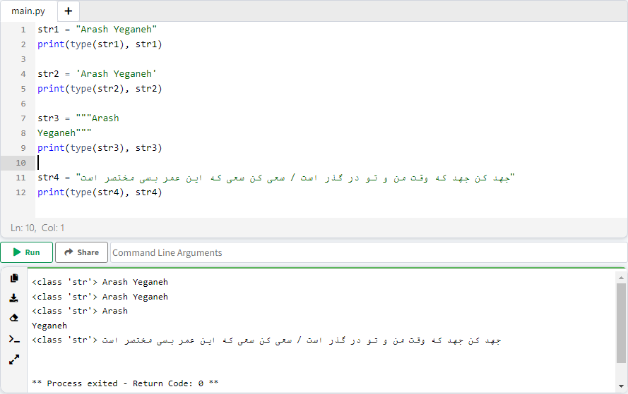

#### ویژگی های String

**ویژگی 1:** هر کاراکتر شامل شماره index می باشد.

```python
str = "Arash Yeganeh"

print(str)
print(str[0], str[1], str[2], str[3], str[4], str[5])
```

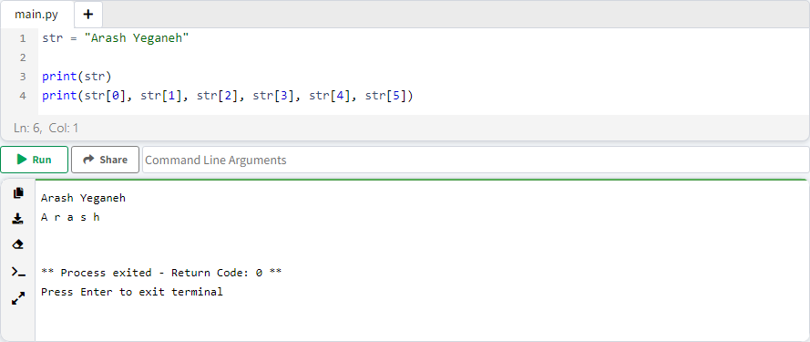


### 2-2. لیست ( List )

به مجموعه ای از دیتا، که هر کدام مستقل از دیگری می باشد، list گفته می شود. هر ایتم دارای ویژگی های ذیل می باشد:

* هر ایتم از دیگری با "," جدا می شود.
*  ایتم ها می توانند data type متفاوتی داشته باشند.
* ایتم ها شامل شماره index می باشند.
*  ترتیب قرار گیری ایتم ها رعایت می شوند.
* اضافه یا حذف کردن ایتم ممکن می باشد.
* ایتم ها غیر قابل بروز رسانی می باشند.
* ایتم ها درون "[ ]" تعریف می شوند.

```python
var = ["string", 10, 10.1, 10.1j]

print(type(var))
print(var)
```


#### ویژگی های List

**ویژگی 1:** هر ایتم شامل شماره index می باشد.

```python
var = ["a", "b", "c", "d", "e", "f"]
print(var)
print(var[0])   # a
print(var[1])   # b  
```

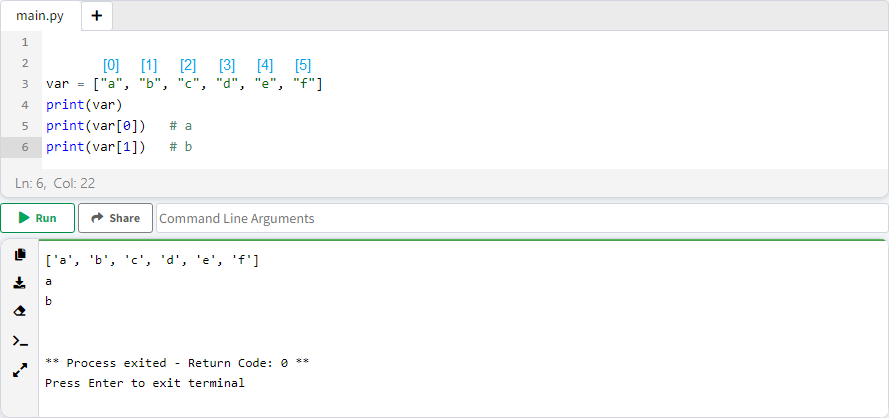

**ویژگی 2:** ایتم ها منحصر بفرد نمی باشند، به عبارت دیگر می توانیم ایتم های مشابه تعریف کنیم.

```python
var = ["arash", "arash", 10, 10]
print(var)
```

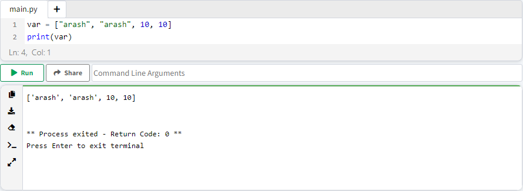

**ویژگی 3:** اضافه یا حذف کردن ایتم ممکن می باشد.

```python
var = ["a", "b", "c", "d", "e", "f"]
print("list: ", var)

var.pop(0)
print("first item removed: ", var)

var.append("Hello")
print("added 'hello' to last of list: ", var)
```

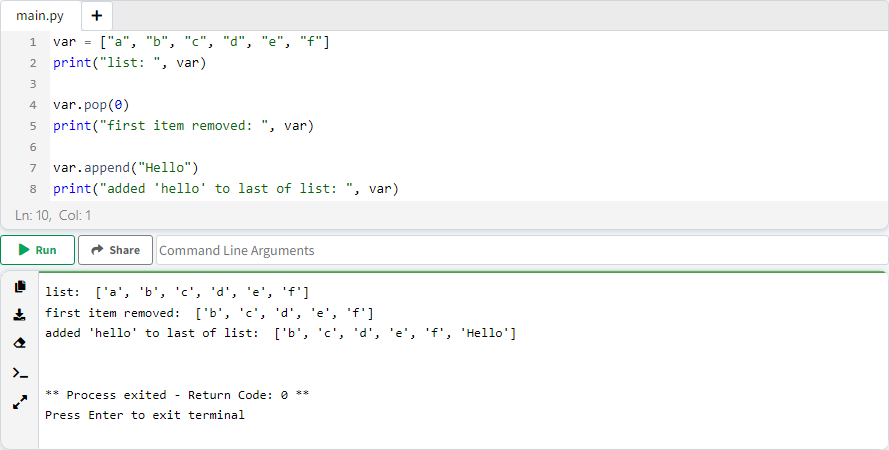

**ویژگی 4:** ایتم ها قابل بروز رسانی می باشند.

```python
var = ["a", "b", "c", "d", "e", "f"]
print("list: ", var)

var[0] = "Hello"
print("list: ", var)
```

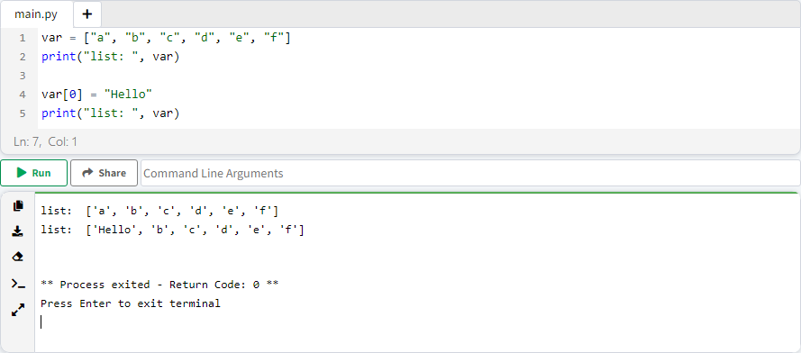

### 3-2. چندتایی ( Tuple )

شامل اکثر خصوصیات list می باشد، با این تفاوت که:

* اضافه یا حذف کردن ایتم ممکن **نمی باشد**.
* ایتم ها قابل بروز رسانی **نمی باشند**.
* ایتم ها درون "( )" تعریف می شوند.

```python
var = ("string", 10, 10.1, 10.1j)

print(type(var))
print(var)
```

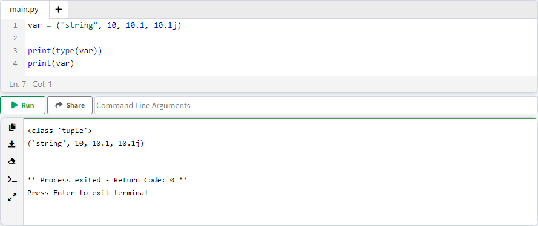

#### مشکل Tuple تک عضوی

به دلیل چند کاربردی بودن پرانتز و اینکه tuple هم از پرانتز استفاده می کند، اگر tuple تک عضوی باشد، ⚠️ متغییر وابسته به جنس داده درون پرانتز می شود در نتیجه tuple نیست.

```python
var = ("Hello")
print(type(var), var)

var = (1)
print(type(var), var)
```

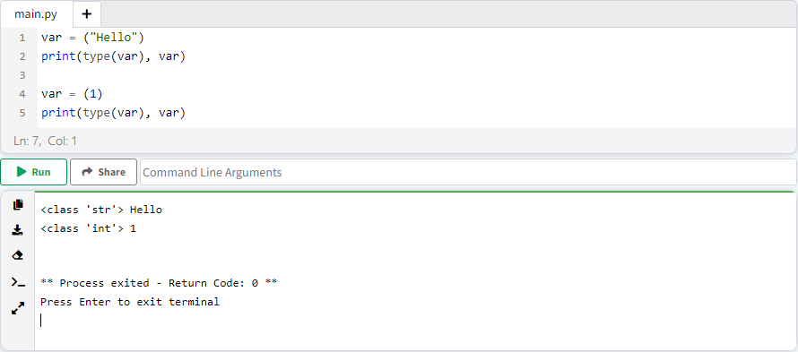

برای رفع این مشکل، کافیست یک ویرگول "," بعد از ایتم اضافه کنیم.

```python
var = ("Hello")
print(type(var), var)

var = (1)
print(type(var), var)
```

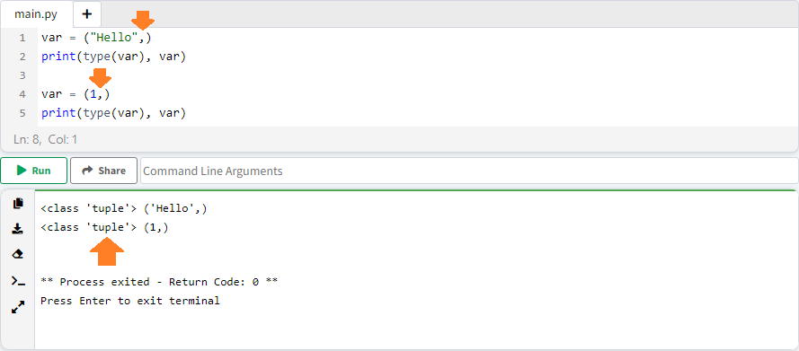

#### ویژگی های Tuple

**ویژگی 1:** هر ایتم شامل شماره index می باشد.

```python
var = ("a", "b", "c", "d", "e", "f")
print(var)
print(var[0])   # a
print(var[1])   # b  
```

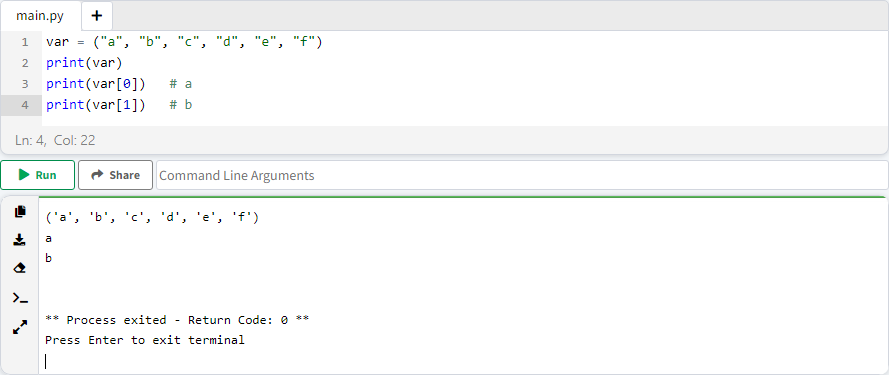

**ویژگی 2:** ایتم ها منحصر بفرد نمی باشند، به عبارت دیگر می توانیم ایتم های مشابه تعریف کنیم.

```python
var = ("arash", "arash", 10, 10)
print(var)
```

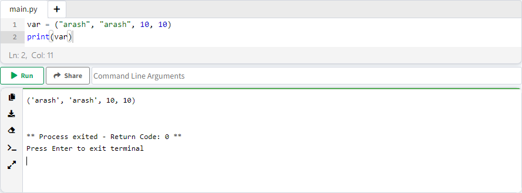

**ویژگی 3:** اضافه یا حذف کردن ایتم ممکن **نمی باشد**.

💡 دقت کنید، به صورت پیش فرض متدی برای اضافه کردن ایتم به tuple تعریف نشده، ولی از انجاییکه عملگر + روی tuple اعمال می شود. می توانیم این کمبود اضافه کردن ایتم به tuple جبران کنیم.

```python
var = ("a", "b")
var += ("c",)
print(var) # ('a', 'b', 'c')
```

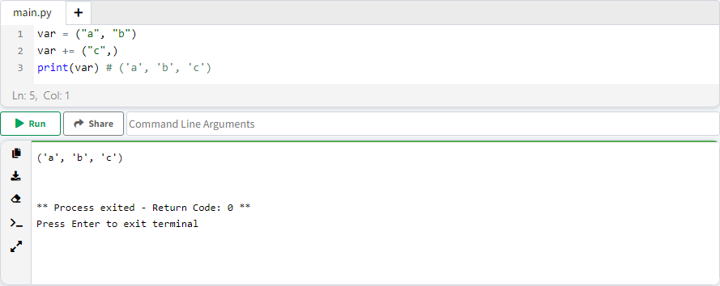

**ویژگی 4:** ایتم ها **غیر قابل** بروز رسانی می باشند.

## 3. ست ( Set )

به مجموعه ای از دیتا، که هر کدام مستقل از دیگری می باشد، set گفته می شود ( به صورت کلی شبیه list و tuple می باشد ). هر ایتم دارای ویژگی های ذیل می باشد:

* هر ایتم از دیگری با "," جدا می شود.
* ایتم ها می توانند data type متفاوتی داشته باشند.
* ایتم ها **فاقد** شماره index می باشند.
* ترتیب قرار گیری ایتم ها رعایت **نمی شوند**.
* اضافه یا حذف کردن ایتم ممکن می باشد.
* ایتم ها **غیر قابل** بروز رسانی می باشند.
* ایتم ها درون "{ }" تعریف می شوند.

```python
var = {"string", 10, 10.1, 10.1j}

print(type(var))
print(var)
```

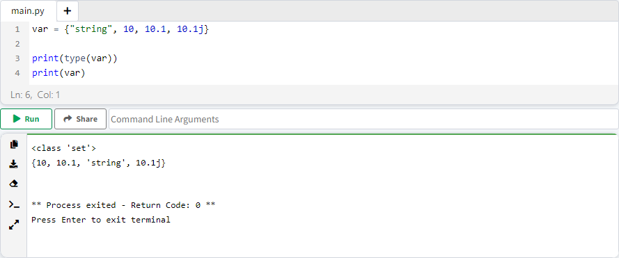

### ویژگی های Set

**ویژگی 1:** اولویت بندی ایتم ها، در زمان دسترسی به set رعایت نمی شوند. ( هر دفعه که صدا زده بشه، ترتیب قرارگیری متفاوت می باشد )

```python
var = {"1-a", "2-b", "3-c", "4-d"}

print(var)
```

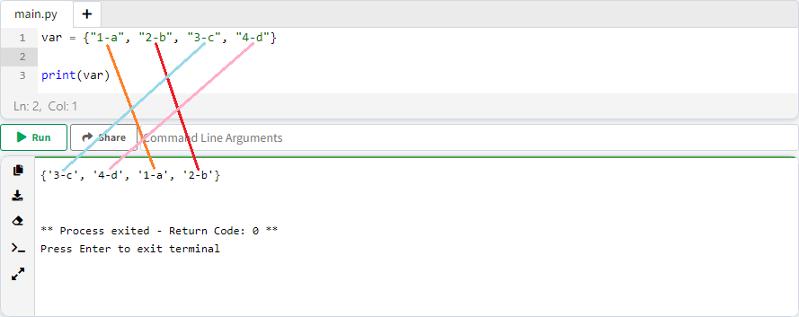

**ویژگی 2**: به دلیل اینکه هر ایتم فاقد شماره index می باشد، امکان دسترسی به ایتم مشخصی وجود ندارد; در نتیجه برای دسترسی به ایتم موردنظر باید، با استفاده از حلقه، تک تک ایتم ها بررسی کنیم.

```python
var = {"1-a", "2-b", "3-c", "4-d"}

for item in var:
    print("item - ", item)
    if item == "1-a":
        print("Equal")
    else:
        print("Not")
```

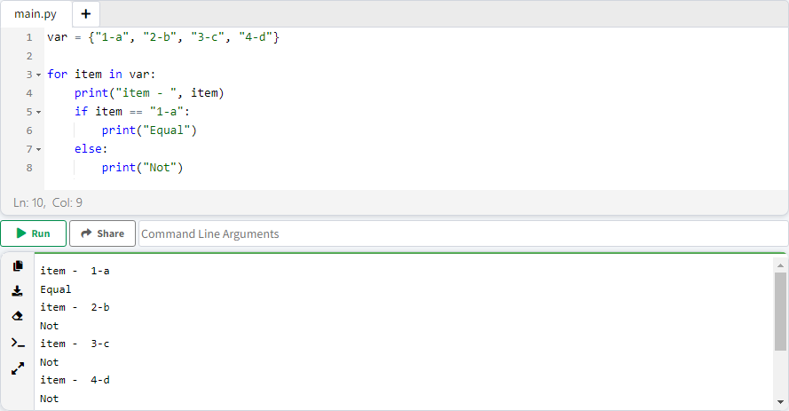

**ویژگی 3:** ایتم ها منحصر بفرد می باشند، به عبارت دیگر نمی توانیم ایتم های مشابه تعریف کنیم. در صورت وجود ایتم مشابه، فقط یکی از ایتم ها قابل استفاده می باشد.

مثال ذیل 4 ایتم تعریف شده که دو به دو مشابه هستند، دقت کنید، خروجی از هر جفت مشابه فقط یک ایتم نمایش داده می شود.

```python
var = {"arash", "arash", 10, 10}
print(var)
```

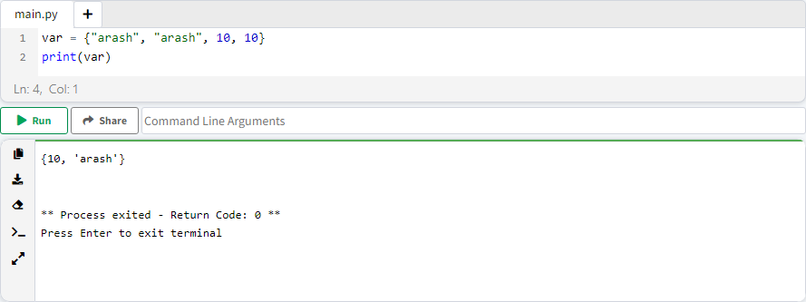

**ویژگی 4:**  اضافه یا حذف کردن ایتم ممکن می باشد.

```python
var = {"a", "b"}
print(var)

var.add("c")
print("added 'c' : ", var)

var.remove("b")
print("removed 'b' :", var)
```

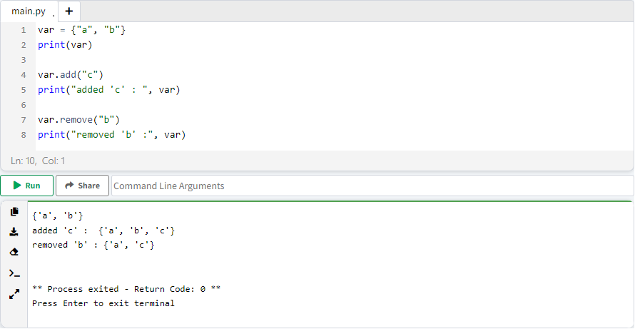

**ویژگی 5:** ایتم ها قابل بروز رسانی **نمی باشند**.

### تفاوت بین set و tuple و list

|       | قالب نوشتاری | بروز رسانی ایتم | اضافه یا حذف ایتم | index | حفظ ترتیب | امکان وجود ایتم مشابه |
| :---: | :----------: | :-------------: | :---------------: | :---: | :-------: | :-------------------: |
| List  |     [ ]      |        ✔️        |         ✔️         |   ✔️   |     ✔️     |           ✔️           |
| Tuple |     ( )      |        ❌        |         ❌         |   ✔️   |     ✔️     |           ✔️           |
|  Set  |     { }      |        ❌        |         ✔️         |   ❌   |     ❌     |           ❌           |

## 4. دیکشنری ( Dictionary  / Dict )

به مجموعه ساختار یافته از دیتای key-value ( دو دویی ) ، dict گفته می شود. دیتا key-value درون "{ }" تعریف می شود.

```python
product = {
  "type": "car",
  "owner": "arash",
  "price": 1_000_000
}

print(product["owner"])
```

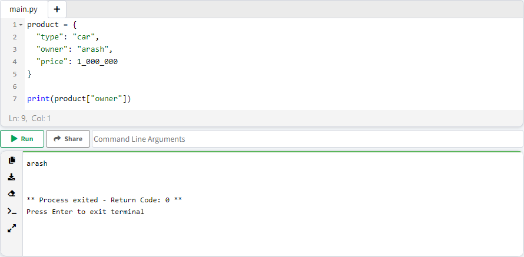

### ساختار key-value چیست؟

این ساختار دو بخش تقسیم می شوند:

* key: مجموعه ای از خصوصیات ( key ) می باشد.
* value: خصوصیات یک مجموعه ( value ) می باشد.

```python
{
  "type": "car",
  "owner": "arash",
  "price": 1_000_000
}
```


* مقادیر key-value باید درون "{ }" تعریف کنیم.
* هر key-value از دیگری با "," جدا می شوند.
* بین key و value با ":" جدا می کنیم.

### ویژگی های Dict

**ویژگی 1:** ترتیب تعریف key-value حفظ می شود.

**ویژگی 2:** اضافه یا حذف کردن key-value ممکن می باشد.

```python
product = {
  "type": "car",
  "owner": "arash",
  "price": 1_000_000
}

product["color"] = "blue"
product.pop("price")
print(product)
```


**ویژگی 3:** key-value  قابل بروز رسانی می باشد.

```python
product = {
  "type": "car",
  "owner": "arash",
  "price": 1_000_000
}

product["owner"] = "mohsen"
product["color"] = "blue"
product.pop("price")
print(product)
```

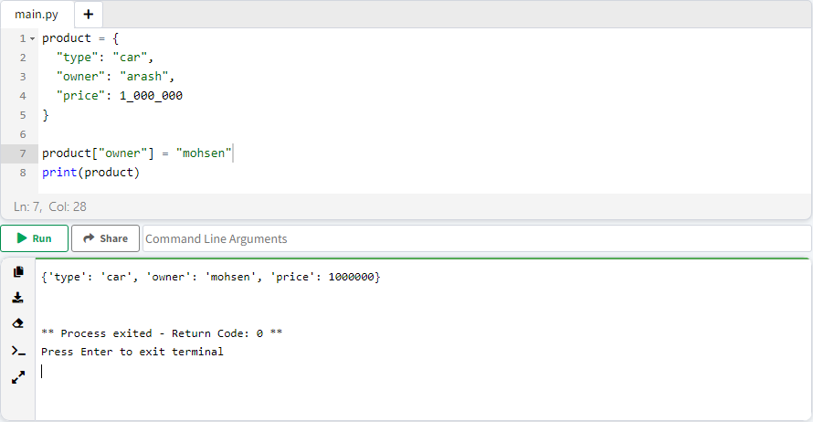

**ویژگی 4:** نام key باید منحصر بفرد باشد، در غیر اینصورت اخرین نام نمایش داده می شود.

```python
product = {
  "type": "car",
  "owner": "arash",
  "owner": "shahram",
  "price": 1_000_000
}

print(product)
```

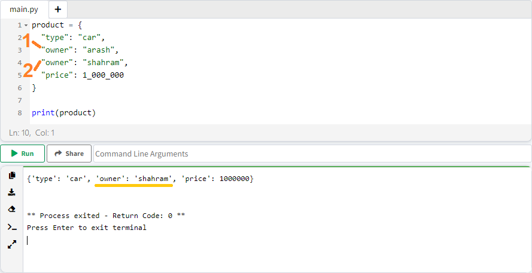

## 5. بولی ( Boolean )

دیتا boolean فقط شامل دو مقدار True و False می شود.

> 💡 دقت کنید، حروف F, T بزرگ می باشند.

```python
T = True
F = False

print(type(T), T)
print(type(F), F)
```

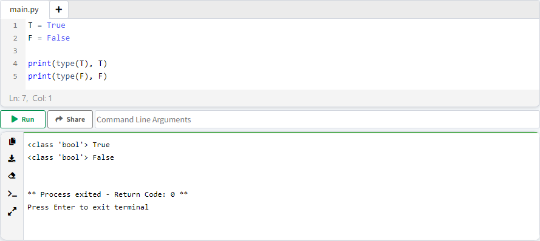

## 6. هیچ ( None )

این دیتا برای مقدار دهی none ( "هیچی" / null ) به یک متغییر می باشد.

```python
N = None

print(type(N), N)
```

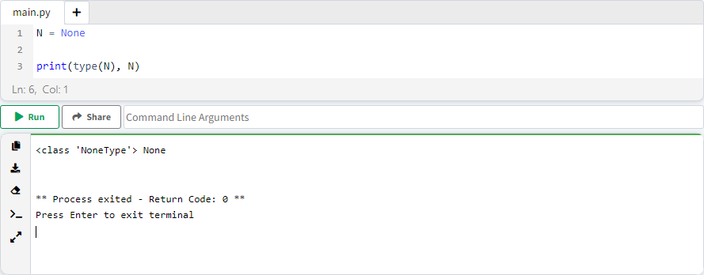


💡 دقت کنید، None به معنی "هیچ" می باشد ولی نباید با سایر انواع دیتا برابر فرض کنیم:

```python
var_tuple = ()
print(type(var_tuple), var_tuple)

var_list = []
print(type(var_list), var_list)

var_dict= {}
print(type(var_dict), var_dict)

var_int= 0
print(type(var_int), var_int)

var_float = 0.0000000000000000000000000000000000000000000000000000000000000
print(type(var_float), var_float)

var_false = False
print(type(var_false), var_false)

var_string = ""
print(type(var_string), var_string)

var_none = None
print(type(var_none), var_none)

```

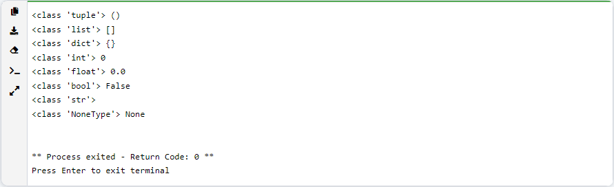


------

👋 Hi, I’m Arash Yeganeh.

How can you best ❤️ **Support me** ❤️  :

- Give me  [GitHub Stars ⭐](https://github.com/arashyeganeh) 
- Share my content to someone else 👀
- Follow me on [linkedin](https://www.linkedin.com/in/arash-yeganeh)
- Subscribe my [YouTube](https://www.youtube.com/channel/UCUuojnAmPiklBpAeBmHE4Aw) channel
