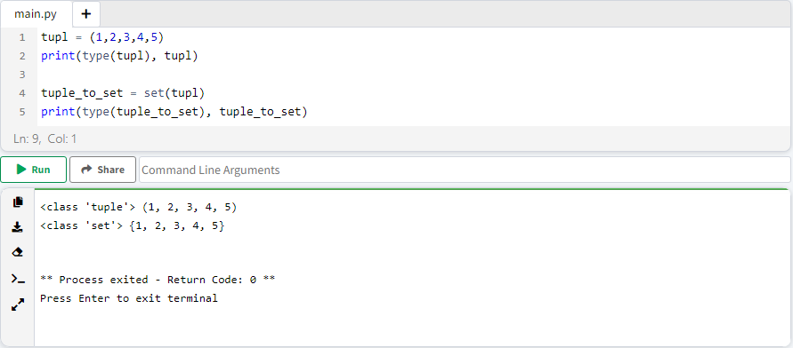

# فصل 9. تبدیل انواع داده ( Type Casting )

به روش تغییر انواع Data type به یکدیگر Type Casting گفته می شود. Type Casting به 2 روش کلی تقسیم می شود:

<ul dir="rtl">
	<li>
		<p>
			Implicit Type Casting
		</p>
	</li>
	<li>
		<p>
			Explicit Type Casting
		</p>
	</li>
</ul>


## تبدیل ضمنی ( Implicit Type Conversion )

زمانیکه چند متغییر تحت تاثیر عملگر های ریاضی ( ضرب، جمع و ... ) قرار می گیرند، مفسر پایتون به صورت خودکار، نوع داده با توجه به اولیت بندی تغییر می دهد.

<ul dir="rtl">
	<li>
		<p>
			به صورت خودکار تبدیل صورت می گیرد.
		</p>
	</li>
	<li>
		<p>
			در فرایند تبدیل، بخشی از اطلاعات حذف نمی شود.
		</p>
	</li>
	<li>
		<p>
			فقط برای تبدیل داده هایی که دارای والدی با جنس یکسان ( data type ) هستند کاربرد دارد.
		</p>
	</li>
</ul>


اولویت Data type های عددی:

<p dir="ltr" align="center">
	<strong>
	Int
	</strong>
	<
	<strong>
	Float
	</strong>
	<
	<strong>
	Complex
	</strong>
</p>

در تبدیل Implicit Type Conversion، دقت کنید **اون داده ای که بالاترین اولویت دارد، Data type نهایی مشخص می کند و ربطی به عملگر ندارد.**

```python
num_int = 10
print(type(num_int), num_int)

num_float = 10.0
print(type(num_float), num_float)

num_complex = 10+1j
print(type(num_complex), num_complex)

print("========================")

print("10 + 10.0", num_int + num_float, type(num_int + num_float))
print("10 + 10.0 + 10+1j", num_int + num_float + num_complex, type(num_int + num_float + num_complex))
```

در مثال فوق:

* در عمل جمع بین int و float به دلیل اولویت بالاتر float، نتیجه حاصل شده، از نوع float می باشد.
* در عمل جمع مابین int, float, complex به دلیل اولویت بالاتر complex، نتیجه حاصل شده، از نوع float می باشد.


**مثال 1:** بررسی تاثیر عملگرهای ریاضی روی int و float

```python
num_int = 10
print(type(num_int), num_int)

num_float = 10.1
print(type(num_float), num_float)

op_sum = num_int + num_float
op_minus = num_int - num_float
op_multiple = num_int * num_float
op_division = num_int / num_float

print(type(op_sum), op_sum)
print(type(op_minus), op_minus)
print(type(op_multiple), op_multiple)
print(type(op_division), op_division)
```

**مثال 2:** بررسی تاثیر عملگرهای ریاضی روی int, float و complex

```python
num_int = 10
print(type(num_int), num_int)

num_float = 10.1
print(type(num_float), num_float)

num_complex = 10+1j
print(type(num_complex), num_complex)

op_sum = num_int + num_float + num_complex
op_minus = num_int - num_float - num_complex
op_multiple = num_int * num_float * num_complex
op_division = num_int / num_float / num_complex

print(type(op_sum), op_sum)
print(type(op_minus), op_minus)
print(type(op_multiple), op_multiple)
print(type(op_division), op_division)
```


## تبدیل صریح ( Explicit Type Conversion )

بر خلاف روش implicit type casting، که محدود به داده های هم نظیر می باشد، این روش مناسب تبدیل داده ها به طیف گسترده تری از data type ها می شود.

<ul dir="rtl">
	<li>
		<p>
			به صورت خودکار تبدیل صورت نمی گیرد.
		</p>
	</li>
	<li>
		<p>
			در فرایند تبدیل، امکان حذف بخشی از اطلاعات وجود دارد.
		</p>
	</li>
	<li>
		<p>
			امکان تبدیل داده ها، به سایر انواع غیر همزاد. ( مثل تبدیل string به int ).
		</p>
	</li>
</ul>

> ⚠️ دقت کنید، بر خلاف روش implicit type conversion، در روش Explicit Type Conversion امکان حذف بخشی از داده وجود دارد.

### 1. تبدیل به عدد صحیح با متد ()int

#### تبدیل عدد اعشاری به صحیح

```python
num_float = 10.999999999
print(type(num_float), num_float)

num_float_to_int = int(num_float)
print(type(num_float_to_int), num_float_to_int)
```


> ⚠️ دقت کنید، قسمت اعشاری داده حذف شده!

#### تبدیل رشته به صحیح

برای تبدیل string به float، باید شرایط ذیل فراهم باشد:

 💡 **1. مقدار string باید فقط و فقط عددی صحیح یا اعشاری باشد.**

```
❌ str = "number 10"
✔️ str = "0.0"
❌ str = "10+5j"
✔️ str = "10"
```

💡 **2. می توانیم از e ( Exponential Notation )  در رشته استفاده کنیم.**

```
✔️ str = "10e4"
```

💡 **3. بین اعداد نباید فضای خالی ( Space ) وجود داشته باشد ولی می توان قبل یا بعد عدد،  فضای خالی قرار بگیرد.**

```
❌ str = "10 10"
✔️ str = "              10"
✔️ str = "10              "
✔️ str = "       10       "
```

💡 **4. می توانیم از "_" برای سادگی در خواندن اعداد بزرگ استفاده کنیم، دقت کنید این روش فقط برای سادگی در خواند اعداد چند رقمی می باشد و تاثیری در خروجی ندارد.**

```
✔️ str = "123_456_789"
```

```python
str1 = "10"
print("str1, Before type casting: ", str1, type(str1))
print("str1, After type casting: ", int(str1), type(int(str1)), "\n=== \n")

str2 = "              10"
print("str2, Before type casting: ", str2, type(str2))
print("str2, After type casting: ", int(str2), type(int(str2)), "\n=== \n")

str3 = "10              "
print("str3, Before type casting: ", str3, type(str3))
print("str3, After type casting: ", int(str3), type(int(str3)), "\n=== \n")

str4 = "       10       "
print("str4, Before type casting: ", str4, type(str4))
print("str4,  type casting: ", int(str4), type(int(str4)), "\n=== \n")

str5 = "123_456_789"
print("str5, Before type casting: ", str5, type(str5))
print("str5, After type casting: ", int(str5), type(int(str5)))
```


### 2. تبدیل به عدد اعشاری با متد ()float

#### تبدیل عدد صحیح به اعشاری

با تبدیل به اعشار، "0." اضافه می شود.

```python
num_int = 10
print(type(num_int), num_int)

num_int_to_float = float(num_int)
print(type(num_int_to_float), num_int_to_float)
```


#### تبدیل رشته به اعشاری

برای تبدیل string به float، باید شرایط ذیل فراهم باشد:

 💡 **1. مقدار string باید فقط و فقط عدد صحیح یا اعشاری باشد.**

```
❌ str = "number 10"
❌ str = "number 10.0"
❌ str = "0.0"
❌ str = "10+5j"
✔️ str = "10"
```

💡 **2. می توانیم از e ( Exponential Notation )  در رشته استفاده کنیم.**

```
✔️ str = "10e4"
```

💡 **3. بین اعداد نباید فضای خالی ( Space ) وجود داشته باشد ولی می توان قبل یا بعد عدد،  فضای خالی قرار بگیرد.**

```
❌ str = "10. 10"
✔️ str = "              10.0"
✔️ str = "10.0              "
✔️ str = "       10.0       "
```

💡 **4. می توانیم از "_" برای سادگی در خواندن اعداد بزرگ استفاده کنیم، دقت کنید این روش فقط برای سادگی در خواند اعداد چند رقمی می باشد و تاثیری در خروجی ندارد.**

```
✔️ str = "123.456_789"
```

```python
str1 = "10.0"
print("str1, Before type casting: ", str1, type(str1))
print("str1, After type casting: ", float(str1), type(float(str1)), "\n=== \n")

str2 = "              10.0"
print("str2, Before type casting: ", str2, type(str2))
print("str2, After type casting: ", float(str2), type(float(str2)), "\n=== \n")

str3 = "10.0              "
print("str3, Before type casting: ", str3, type(str3))
print("str3, After type casting: ", float(str3), type(float(str3)), "\n=== \n")

str4 = "       10.0       "
print("str4, Before type casting: ", str4, type(str4))
print("str4,  type casting: ", float(str4), type(float(str4)), "\n=== \n")

str5 = "10e4"
print("str5, Before type casting: ", str5, type(str5))
print("str5,  type casting: ", float(str5), type(float(str5)), "\n=== \n")

str6 = "123.456_789"
print("str6, Before type casting: ", str6, type(str6))
print("str6,  type casting: ", float(str6), type(float(str6)))
```


### 3. تبدیل به عدد مختلط با متد ()complex

متد (a,b)complex دو آرگومان دریافت می کند.

<div align="center">
<span>a</span>
 + <span>b</span>j
</div>

* پارامتر a : عدد حقیقی و الزامی می باشد.
* پارامتر b : عدد حقیقی و اختیاری می باشد، به صورت پیش فرض مقدار صفر دارد.

```python
num_complex = complex(10)
print(type(num_complex), num_complex)

num_complex_with_b = complex(10, 5)
print(type(num_complex_with_b), num_complex_with_b)
```


#### تبدیل عدد صحیح به مختلط

```python
num_int = 10
print(type(num_int), num_int)

int_to_complex = complex(num_int)
print(type(int_to_complex), int_to_complex)
```


#### تبدیل عدد اعشاری به مختلط

```python
num_float = 10.0
print(type(num_float), num_float)

int_to_complex = complex(num_float)
print(type(int_to_complex), int_to_complex)
```


#### تبدیل رشته به مختلط

برای تبدیل string به complex، باید شرایط ذیل فراهم باشد:

 💡 **1. مقدار string باید فقط و فقط عدد صحیح، اعشاری یا مختلط باشد.**

```
❌ str = "number 10"
❌ str = "number 10.0"
✔️ str = "0.0"
✔️ str = "10"
✔️ str = "10+5j"
❌ str = "10+0"
✔️ str = "10"
✔️ str = "10+0j"
✔️ str = "0j"
```

💡 **2. می توانیم از e ( Exponential Notation )  در رشته استفاده کنیم.**

```
✔️ str = "10e4"
```

💡 **3. بین اعداد نباید فضای خالی ( Space ) وجود داشته باشد ولی می توان قبل یا بعد عدد،  فضای خالی قرار بگیرد.**

```
❌ str = "10+ 5j"
✔️ str = "              10+5j"
✔️ str = "10+5j              "
✔️ str = "       10+5j       "
```

💡 **4. می توانیم از "_" برای سادگی در خواندن اعداد بزرگ استفاده کنیم، دقت کنید این روش فقط برای سادگی در خواند اعداد چند رقمی می باشد و تاثیری در خروجی ندارد.**

```
✔️ str = "123_456"
```

💡 **5. در رشته، اگر پارامتر موهومی ( j ) نباشد، به صورت پیش فرض مقدار b برابر با صفر در نظر گرفته می شود.**

💡 **6. دقت کنید که رشته باید عدد مختلط با ساختار درست  باشد و یا اینکه فاقد هر گونه عملگر باشد.**

```
❌ str = "10+0" # Missed "j"
✔️ str = "10"
✔️ str = "10+0j"
✔️ str = "0j"
```

```python
str1 = "10+5j"
print("str1, After type casting: ", complex(str1), type(complex(str1)), "\n===")

str2 = "              10+5j"
print("str2, After type casting: ", complex(str2), type(complex(str2)), "\n===")

str3 = "10+5j              "
print("str3, After type casting: ", complex(str3), type(complex(str3)), "\n===")

str4 = "       10+5j       "
print("str4,  type casting: ", complex(str4), type(complex(str4)), "\n===")

str5 = "10e4"
print("str5,  type casting: ", complex(str5), type(complex(str5)), "\n===")

str6 = "123_45"
print("str6,  type casting: ", complex(str6), type(complex(str6)), "\n===")

str7 = "0"
print("str8,  type casting: ", complex(str7), type(complex(str7)), "\n===")

str8 = "0j"
print("str8,  type casting: ", complex(str8), type(complex(str8)))
```


### 4. تبدیل به رشته با متد ()str

#### تبدیل عدد صحیح به رشته

```python
num_int = 10
print(type(num_int), num_int)

num_int_to_string = str(num_int)
print(type(num_int_to_string), num_int_to_string)
```


#### تبدیل عدد اعشاری به رشته

```python
num_float = 10.0
print(type(num_float), num_float)

num_float_to_string = str(num_float)
print(type(num_float_to_string), num_float_to_string)
```


#### تبدیل عدد مختلط به رشته

```python
num_complex = 10+1j
print(type(num_complex), num_complex)

num_complex_to_string = str(num_complex)
print(type(num_complex_to_string), num_complex_to_string)
```


### 5. تبدیل به لیست با متد ()list

#### تبدیل رشته به لیست

```python
str = "arash 123"
print(type(str), str)

string_to_list = list(str)
print(type(string_to_list), string_to_list)
```


#### تبدیل تاپل به لیست

```python
tup = (1,2,3,4,5)
print(type(tup), tup)

tuple_to_list = list(tup)
print(type(tuple_to_list), tuple_to_list)
```


#### تبدیل ست به لیست

```python
se = {1,2,3,4,5}
print(type(se), se)

set_to_list = list(se)
print(type(set_to_list), set_to_list)
```


### 6. تبدیل به تاپل با متد ()tuple

#### تبدیل رشته به تاپل

```python
str = "arash 123"
print(type(str), str)

string_to_tuple = tuple(str)
print(type(string_to_tuple), string_to_tuple)
```


#### تبدیل لیست به تاپل

```python
lis = [1,2,3,4,5]
print(type(lis), lis)

list_to_tuple = tuple(lis)
print(type(list_to_tuple), list_to_tuple)
```


#### تبدیل ست به تاپل

```python
se = {1,2,3,4,5}
print(type(se), se)

set_to_tuple = tuple(se)
print(type(set_to_tuple), set_to_tuple)
```


### 7. تبدیل به ست با متد ()set

#### تبدیل رشته به ست

```python
str = "arash 123"
print(type(str), str)

string_to_set = set(str)
print(type(string_to_set), string_to_set)
```


#### تبدیل تاپل به ست

```python
tupl = (1,2,3,4,5)
print(type(tupl), tupl)

tuple_to_set = set(tupl)
print(type(tuple_to_set), tuple_to_set)
```



#### تبدیل لیست به ست

```python
lis = [1,2,3,4,5]
print(type(lis), lis)

list_to_set = set(lis)
print(type(list_to_set), list_to_set)
```


### 8. تبدیل به دیکشنری با متد ()dict

به دلیل اینکه دیکشنری از ساختار key-value تشکیل شده، برای حفظ این ساختار باید، هر ایتم خود حاوی **جفت داده** باشد، برای این منظور، باید هر ایتم، یکی از سه نوع tuple, list و یا set باشد.

> 💡 هر ایتم، بدون توجه به والد خودش می تواند یکی از سه نوع list,tuple و set باشد.

#### تبدیل لیست به دیکشنری

```python
print("==== list inside list ====")
list_inside_list = [['key-A', 1], ['key-B',2], ['key-C',3]]
list_to_dict = dict(list_inside_list)
print(type(list_to_dict), list_to_dict)

print("==== tuple inside list ====")
tuple_inside_list = [('key-A', 1), ('key-B',2), ('key-C',3)]
list_to_dict = dict(tuple_inside_list)
print(type(list_to_dict), list_to_dict)

print("==== set inside list ====")
set_inside_list = [{'key-A', 1}, {'key-B',2}, {'key-C',3}]
list_to_dict = dict(set_inside_list)
print(type(list_to_dict), list_to_dict)
```


> 💡 دقت کنید، به دلیل عدم رعایت ترتیب در set، با تبدیل آن به نوع دیکشنری، مقدار key و value ها جا به جا می شوند!

#### تبدیل تاپل به دیکشنری

```python
print("==== list inside tuple ====")
list_inside_tuple = (['key-A', 1], ['key-B',2], ['key-C',3])
tuple_to_dict = dict(list_inside_tuple)
print(type(tuple_to_dict), tuple_to_dict)

print("==== tuple inside tuple ====")
tuple_inside_tuple = (('key-A', 1), ('key-B',2), ('key-C',3))
tuple_to_dict = dict(tuple_inside_tuple)
print(type(tuple_to_dict), tuple_to_dict)

print("==== set inside tuple ====")
set_inside_tuple = ({'key-A', 1}, {'key-B',2}, {'key-C',3})
tuple_to_dict = dict(set_inside_tuple)
print(type(tuple_to_dict), tuple_to_dict)
```


> 💡 دقت کنید، به دلیل عدم رعایت ترتیب در set، با تبدیل آن به نوع دیکشنری، مقدار key و value ها جا به جا می شوند!

#### تبدیل set به دیکشنری

برای تعریف داده های تو در تو در set، هر ایتم فقط می تواند از نوع tuple باشد.

```python
tuple_inside_set = {('key-A', 1), ('key-B',2), ('key-C',3)}
set_to_dict = dict(tuple_inside_set)
print(type(set_to_dict), set_to_dict)
```


> 💡 دقت کنید، به دلیل عدم رعایت ترتیب در set، با تبدیل آن به نوع دیکشنری، مقدار key و value ها جا به جا می شوند!

### 9. تبدیل به بولین با متد ()bool

مقادیر بولین محدود به دو مقدار True و False می باشد. باتوجه به مقدار ورودی که به متد bool می دهیم، خروجی این متد از نوع boolean می باشد.

هر مقداری که شامل موارد ذیل باشد مقدار False برگشت می دهد:

* مقدار False
* مقدار 0
* مقدار None
* رشته های تهی ""
* لیست تهی []
* تاپل تهی ()
* ست تهی {}
* دیکشنری تهی {}

**در غیر اینصورت مقدار True برگشت می دهد.**

#### رشته ( String )

رشته های تهی، مقدار False برگشت می دهند.

```python
print("Empty String", bool(""))

print(bool(" "))
print(bool("[]"))
print(bool("{}"))
print(bool("()"))
print(bool("None"))
print(bool("0"))
print(bool("False"))
```


#### اعداد ( Int, Float, Complex )

اعداد صفر، مقدار False برگشت می دهند.


#### لیست ( List )

لیست های فاقد عضو، مقدار False برگشت می دهند.

```python
print("Empty list =>", bool([]),"\n===")

print(bool([0]))
print(bool([""]))
print(bool([None]))
print(bool([[]]))
print(bool([()]))
print(bool([{}]))
print(bool([False]))
```


#### تاپل ( Tuple )

تاپل های فاقد عضو، مقدار False برگشت می دهند.

```python
print("Empty tuple =>", bool(()),"\n===")

print(bool((0,)))
print(bool(("",)))
print(bool((None,)))
print(bool(([],)))
print(bool(((),)))
print(bool(({},)))
print(bool((False,)))
```


#### ست ( Set )

ست های فاقد عضو، مقدار False برگشت می دهند.

> 💡 دقت کنید، برای ساخت set بدون عضو باید از متد set استفاده کنیم. اگر بنویسیم "{}" به معنی دیکشنری می باشد.
>
> ```python
> empty_dict = {} # {} <class 'dict'>
> print(empty_dict, type(empty_dict))
> 
> empty_set = set() # set() <class 'set'>
> print(empty_set, type(empty_set))
> ```

```python
empty_set = set()
print("Empty set =>", bool(empty_set),"\n===")

print(bool({0}))
print(bool({""}))
print(bool({None}))
print(bool({()}))
print(bool({False}))
```


#### دیکشنری ( Dict )

دیکشنری فاقد عضو، مقدار False برگشت می دهد.

```python
print("Empty dict =>", bool({}),"\n===")

print(bool({0: 0}))
print(bool({"": ""}))
print(bool({None: None}))
print(bool({False: False}))
```


#### بولین ( boolean )

```python
print(bool(False)) # False
print(bool(True)) # True
```

#### هیچ ( None )

```python
print(bool(None)) # False
```

### 10. تبدیل به کد ASCII با متد ()ord

کد اسکی ( ASCII )، یک سیستم 7 بیتی که شامل 128 کاراکتر می باشد و به منظور دریافت کاراکتر از کیبورد طراحی شده. متد ord، کد اسکی هر کاراکتر برگشت می دهد.

* آرگومان متد ord باید به صورت رشته باشد.
* ارگومان فقط یک کاراکتر قبول می کند.

```python
print("a ->", ord('a'))
print("A ->", ord('A'))
print("2 ->", ord('2'))
print("@ ->", ord('@'))
print("$ ->", ord('$'))
```


### 11. تبدیل عدد صحیح به مبنای 16 با متد ()hex

> 💡 دقت کنید، مقدار برگشتی متد hex از نوع رشته می باشد.

```python
print("10 ->", hex(10))
print("90 ->", hex(90))
print("123456 ->", hex(123456))
print("0 ->", hex(0))
```


### 12. تبدیل عدد صحیح به مبنای 8 با متد ()oct

> 💡 دقت کنید، مقدار برگشتی متد oct از نوع رشته می باشد.

```python
print("10 ->", oct(10))
print("90 ->", oct(90))
print("123456 ->", oct(123456))
print("0 ->", oct(0))
```


### 13. تبدیل عدد صحیح به باینری با متد ()bin

> 💡 دقت کنید، مقدار برگشتی متد bin از نوع رشته می باشد.

```python
print("10 ->", bin(10))
print("90 ->", bin(90))
print("123456 ->", bin(123456))
print("0 ->", bin(0))
```


------

👋 Hi, I’m Arash Yeganeh.

How can you best ❤️ **Support me** ❤️  :

- Give me  [GitHub Stars ⭐](https://github.com/arashyeganeh) 
- Share my content to someone else 👀
- Follow me on [linkedin](https://www.linkedin.com/in/arash-yeganeh)
- Subscribe my [YouTube](https://www.youtube.com/channel/UCUuojnAmPiklBpAeBmHE4Aw) channel

